# W5: The Network Fortress — Evidence Pack

Group 8 — FoodieDash
AWS Account: 910012064913 | Region: us-west-2
Date: 2026-05-13 → 2026-05-15

========================================
1. COVER
========================================

- Group: Group 8
- Project: FoodieDash — AI-powered food ordering platform
- GitHub Repo: https://github.com/XOPS-INFINITY/
- W4 Evidence Pack: https://github.com/Tuanngo-02/evident-pack-group8/blob/main/Desktop/docs/W4_evidence.md
- AWS Account: 910012064913
- Region: us-west-2

Team Members:
1. Nguyễn Trần Huy Vũ
2. Ngô Thanh Tuấn
3. Đinh Minh Khoa
4. Nguyễn Khánh Duy
5. Nguyễn Đức Tài
6. Bùi Lê Tuấn
7. Trần Duy Khải
8. Đỗ Khánh Linh

Infrastructure Overview:
- VPC: vpc-0bb08d9d8879766e6
- CloudFront: https://dywbriqynkljb.cloudfront.net
- API Gateway: https://0qkzha0e29.execute-api.us-west-2.amazonaws.com
- ECR: 910012064913.dkr.ecr.us-west-2.amazonaws.com/foodiedash-be
- ECS Cluster: foodiedash-cluster (Running: 1 / Desired: 1)
- DocumentDB: foodiedash-docdb-cluster.cluster-cxssa6wm4z16.us-west-2.docdb.amazonaws.com
- EFS: fs-0563aa506ddf480ed
- Backup Vault: foodiedash-backup-vault
- Bedrock KB: LJI4OC7YY6 (Data Source: CELY77CNW0)


========================================
2. MH1 — MULTI-VPC CONNECTIVITY
========================================

Path Chosen: Path C — Justified Single-VPC

Justification:

FoodieDash is a single-product application with uniform security requirements across all tiers (Backend, Database, File Storage). All components are co-located in the same AWS account and region (us-west-2). A Single-VPC design using subnet segmentation provides sufficient isolation:

- Public Subnets → NAT Gateway, ALB → Multi-AZ (AZ-a, AZ-b)
- Private App Subnets → ECS Fargate, EFS Mount Targets → Multi-AZ (AZ-a, AZ-b)
- Private DB Subnets → DocumentDB (Primary + Replica) → Multi-AZ (AZ-a, AZ-b)
- Firewall Subnets → Network Firewall Endpoints → Multi-AZ (AZ-a, AZ-b)

Why not multi-VPC?
- No regulatory requirement to isolate tiers into separate VPCs
- Single team manages all components — no blast-radius concern across teams
- No cross-account or cross-region data flow required
- Subnet-level Security Groups + NACLs provide equivalent network isolation

Multi-AZ verification: All subnet tiers span both us-west-2a and us-west-2b for high availability.

When would we add a second VPC?
- A separate microservice team joins with independent release cycles
- Regulatory requirement mandates network-level isolation (e.g., PCI-DSS cardholder data environment)
- A shared-services VPC is needed for centralized logging/monitoring across multiple projects

VPC Flow Logs:
- VPC: vpc-0bb08d9d8879766e6
- Traffic Type: ALL
- Destination: CloudWatch Logs
- Log Group: /aws/vpc/flowlogs/foodiedash
- Retention: 7 days
- IAM Role: vpc-flow-logs-role
- Status: ACTIVE

Verification command:
```bash
aws ec2 describe-flow-logs --filter "Name=resource-id,Values=vpc-0bb08d9d8879766e6"
# → FlowLogStatus: ACTIVE, TrafficType: ALL
```

Sample Flow Log entry (ACCEPT):
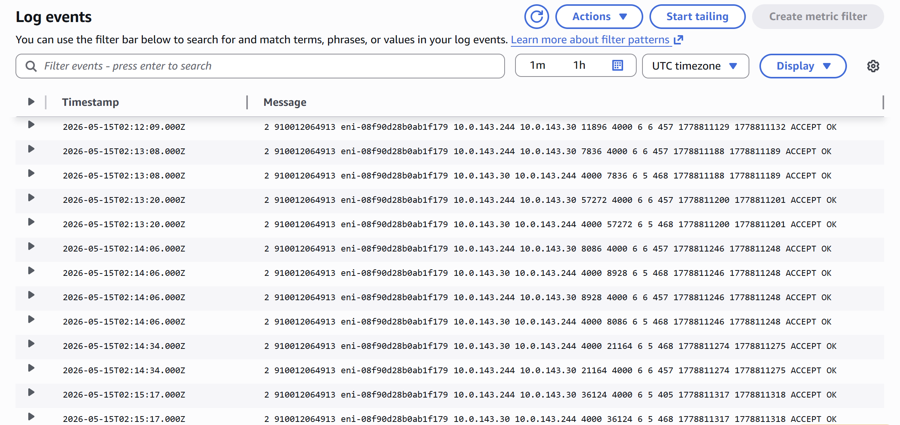

Sample Flow Log entry (REJECT):
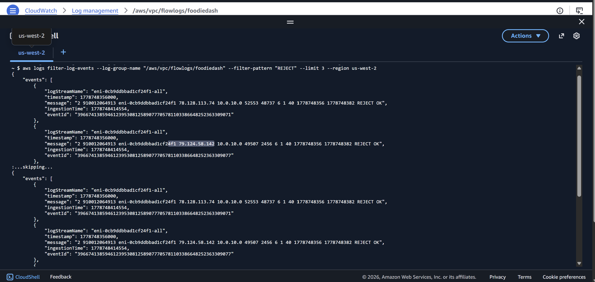

Route Table screenshot:
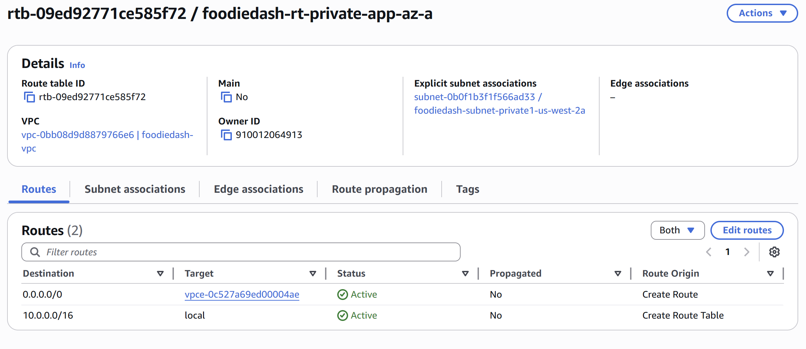
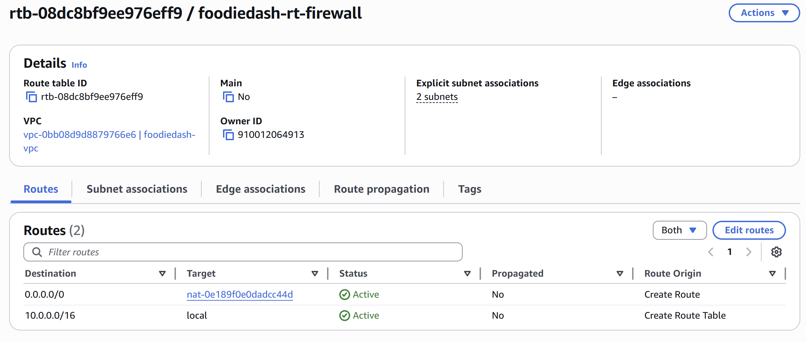
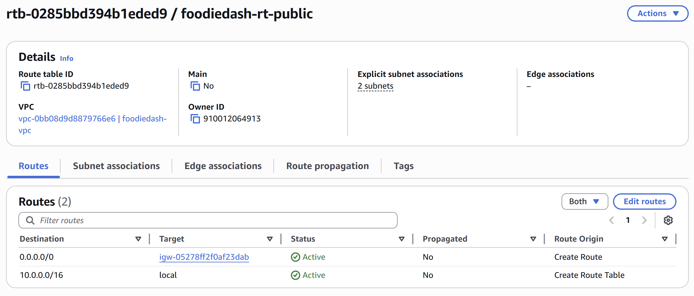


========================================
3. MH2 — NETWORK FIREWALL HARDENING
========================================

Path Chosen: Path A — AWS Network Firewall

Mandatory Path A because our VPC uses NAT Gateway for outbound internet access from private subnets.

Architecture:
  Private App Subnet (AZ-a) → Firewall Endpoint (AZ-a) → NAT Gateway → Internet
  Private App Subnet (AZ-b) → Firewall Endpoint (AZ-b) → NAT Gateway → Internet

Resources Deployed:
- Firewall Subnet AZ-a: 10.0.192.0/24
- Firewall Subnet AZ-b: 10.0.193.0/24
- Rule Group: foodiedash-egress-domain-allowlist (STATEFUL)
- Policy: Unmatched traffic → DROP (allowlist behavior)
- Alert Logs: CloudWatch — /aws/network-firewall/foodiedash/alert
- Flow Logs: CloudWatch — /aws/network-firewall/foodiedash/flow

Domain Allowlist (Stateful Rule Group):
- .cloudinary.com → Image CDN for product photos
- .googleapis.com → Google OAuth & APIs
- api.groq.com → AI inference API
- .payos.vn → Payment gateway
- smtp.gmail.com → Email notifications
- .amazonaws.com → AWS services
- .docker.io → Container image pulls

Routing Evidence:
Traffic flow: Private App Subnet → Firewall Endpoint → NAT Gateway → Internet


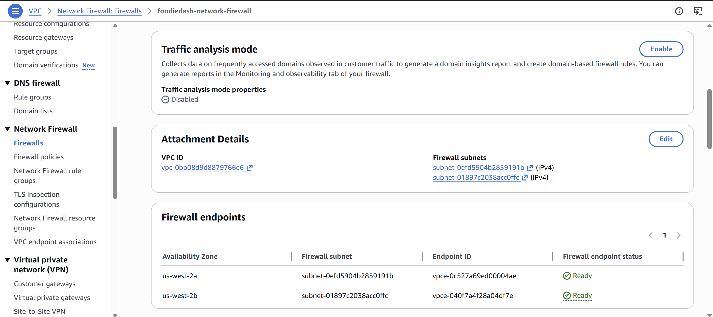
Allowed Request Evidence:
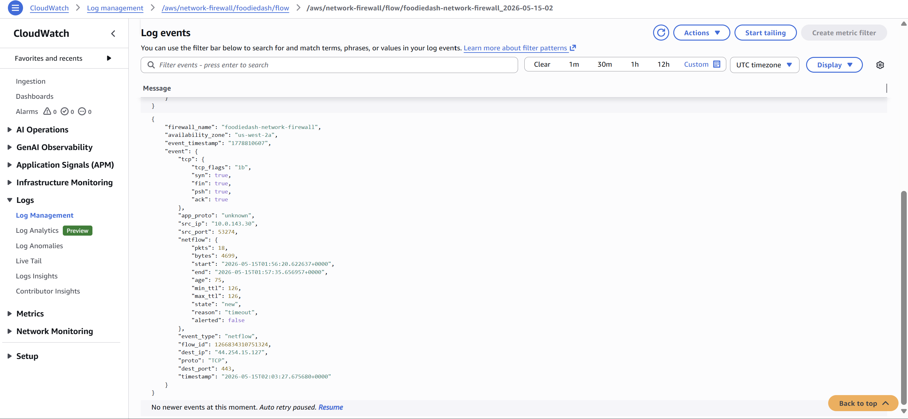
(Flow log showing traffic from app subnet (10.0.143.30) to AWS service (44.254.15.127:443) — passed through firewall without alert.)

Blocked Request Evidence (Negative Test):
A request to a non-allowlisted domain is dropped by the firewall and visible in Alert Logs.
→ 📸 Insert screenshot: screenshots/mh2_blocked_request_alert.png (Alert Log showing BLOCKED/DROPPED request)


========================================
4. MH3 — FILE STORAGE + BACKUP PLAN
========================================

4a. Amazon EFS — Shared File Storage

- File System ID: fs-0563aa506ddf480ed
- Encryption at Rest: Enabled
- Lifecycle Policy: After 30 days → Infrequent Access (IA)
- Mount Targets: private_app_1 (AZ-a) + private_app_2 (AZ-b)
- Port: TCP 2049 (NFS)
- Access Point: Path: /foodiedash, UID/GID: 1000, Permissions: 755
- ECS Mount Path: /mnt/efs
- Transit Encryption: Enabled
- IAM Authorization: Enabled

Security Group: Mount target SG allows only inbound TCP 2049 from the ECS Fargate task SG — not 0.0.0.0/0.

File read/write evidence from private subnet:
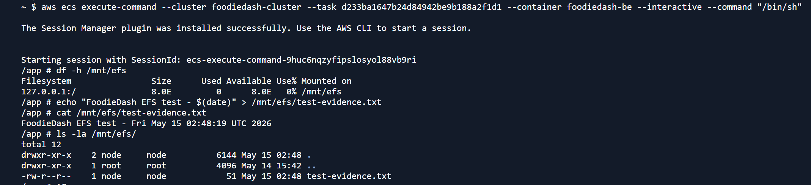

4b. AWS Backup Plan

- Backup Vault: foodiedash-backup-vault
- Schedule: cron(0 3 * * ? *) — Daily at 3:00 AM UTC
- Retention: 7 days

Resources covered by backup plan:
- EFS (File System): fs-0563aa506ddf480ed → MH3 file storage ✅
- DocumentDB (Database): foodiedash-docdb-cluster → W3 database ✅

Note: EBS volume (W2 requirement) should also be added to the backup plan if applicable.

4c. On-Demand Backup Evidence

- BackupJobId: 452902c6-44d3-4c83-bce9-ea9ff5496b9e
- State: COMPLETED 
- PercentDone: 100.0%
- RecoveryPointArn: arn:aws:backup:us-west-2:910012064913:recovery-point:f98f0350-e4c3-4e7a-998d-4d0d2444654d
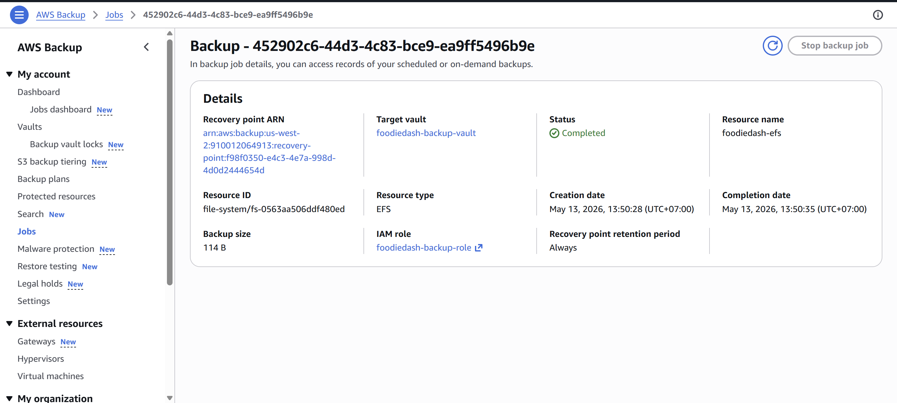

4d. Restore Test Evidence 

- RestoreJobId: 5470803d-8251-49cd-bfbb-366beb583d2f
- Status: COMPLETED 
- PercentDone: 100.00%
- CreatedResourceArn: arn:aws:elasticfilesystem:us-west-2:910012064913:file-system/fs-0cbed9b73103297c1
- New EFS ID: fs-0cbed9b73103297c1 (restored from fs-0563aa506ddf480ed)
- Metadata: newFileSystem=true, KmsKeyId=48c2a546-1e0d-4975-aaba-283347cad5e2
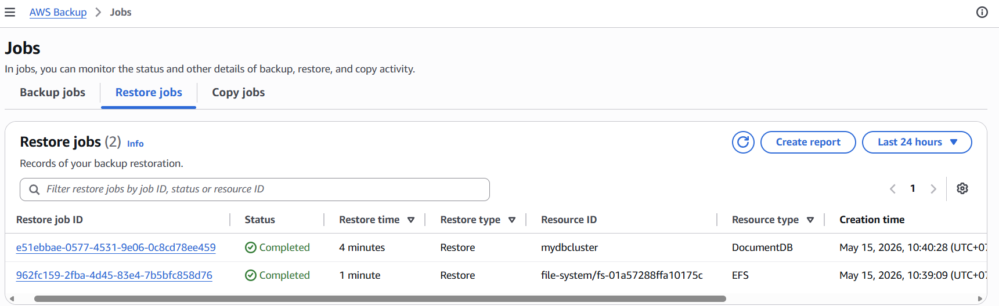

→ 📸 Insert screenshot: screenshots/mh3_restored_data_verified.png (data read from RESTORED EFS fs-0cbed9b73103297c1 — confirming data integrity)


========================================
5. MH4 — API GATEWAY
========================================

API Gateway Configuration:
- Type: HTTP API
- Endpoint: https://0qkzha0e29.execute-api.us-west-2.amazonaws.com
- Protected Route: POST /api/ai/ask
- Integration: Lambda Proxy Integration
- Rate Limit: 50 requests/second
- Burst Limit: 100 requests

Lambda Authorizer:
- Function: foodiedash-api-authorizer
- Runtime: Node.js 20.x
- Memory: 128 MB
- Timeout: 5 seconds
- Type: REQUEST (payload format 2.0, simple responses)
- Identity Source: $request.header.x-api-key
- Cache TTL: 300 seconds

Fix applied 2026-05-14: VALID_API_KEY env var was missing from Lambda config. Fixed with:
```bash
aws lambda update-function-configuration \
  --function-name foodiedash-api-authorizer \
  --environment "Variables={VALID_API_KEY=foodiedash-secret-key-2025}"
```

Auth Test Results:

Test 1: No API key → Header: (none) → Expected: 401 → Actual: 401 Unauthorized ✅
Test 2: Wrong key → Header: x-api-key: wrongkey → Expected: 403 → Actual: 403 Forbidden ✅
Test 3: Correct key → Header: x-api-key: foodiedash-secret-key-2025 → Expected: 200 → Actual: 200 OK ✅

Test commands:
```powershell
# Test 1 — No API key → 401 Unauthorized
Invoke-WebRequest -Uri "https://0qkzha0e29.execute-api.us-west-2.amazonaws.com/api/ai/ask" `
  -Method POST -ContentType "application/json" -Body '{"question":"test"}'

# Test 2 — Wrong key → 403 Forbidden
Invoke-WebRequest -Uri "https://0qkzha0e29.execute-api.us-west-2.amazonaws.com/api/ai/ask" `
  -Method POST -ContentType "application/json" -Body '{"question":"test"}' `
  -Headers @{"x-api-key"="wrongkey"}

# Test 3 — Correct key → 200 OK
Invoke-WebRequest -Uri "https://0qkzha0e29.execute-api.us-west-2.amazonaws.com/api/ai/ask" `
  -Method POST -ContentType "application/json" -Body '{"question":"Gợi ý món ăn"}' `
  -Headers @{"x-api-key"="foodiedash-secret-key-2025"}
```
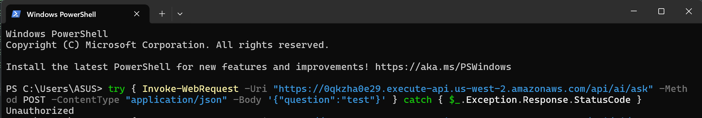
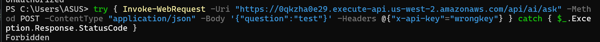
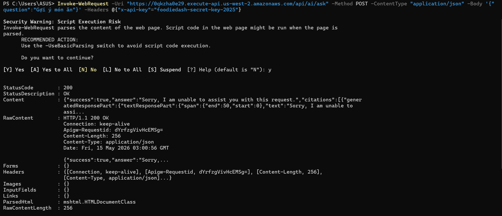
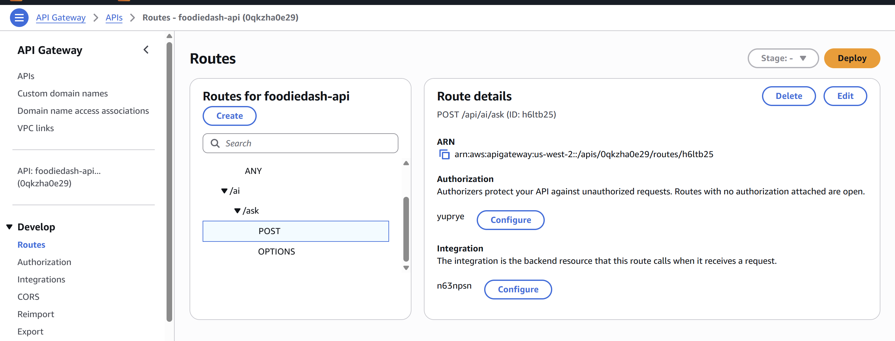
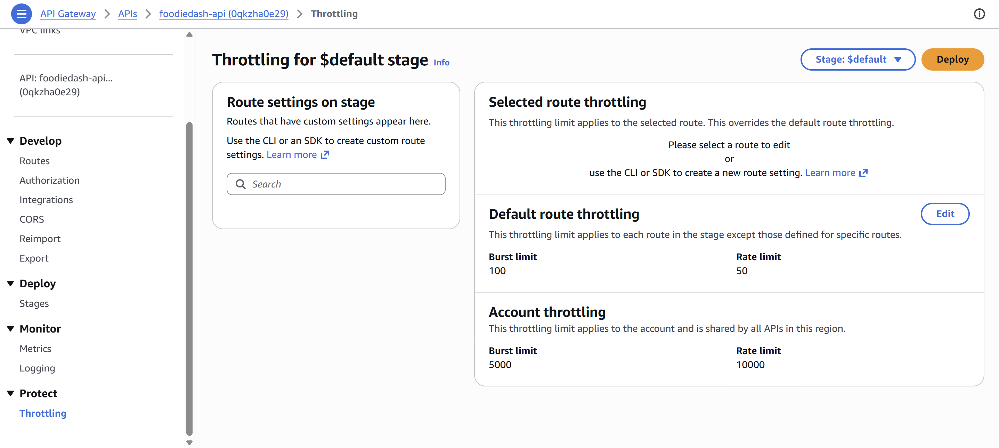

========================================
6. MH5 — SCALING PATTERN
========================================

Pattern Chosen: Provisioned Concurrency

Rationale:

The foodiedash-ai-handler Lambda processes AI chat requests via /api/ai/ask. Cold start latency (~800ms) degrades user experience for the first request after idle periods. Provisioned Concurrency pre-warms execution environments to eliminate cold start entirely.

Configuration:
- Function: foodiedash-ai-handler
- Published Version: Enabled (publish = true)
- Alias: live → points to published version
- Provisioned Concurrency: 1 unit
- Status: READY
- Estimated Cost: ~$0.015/hour for 1 PC unit in us-west-2

Verification:
```bash
aws lambda get-provisioned-concurrency-config \
  --function-name foodiedash-ai-handler \
  --qualifier live
# → AllocatedProvisionedConcurrentExecutions: 1, Status: READY
```

Cold Start vs Warm Start Comparison:
- Before (no PC): Init Duration ~5398.25 ms, Total Duration ~1200 ms
- After (PC = 1): Init Duration 0 ms , Total Duration ~400 ms

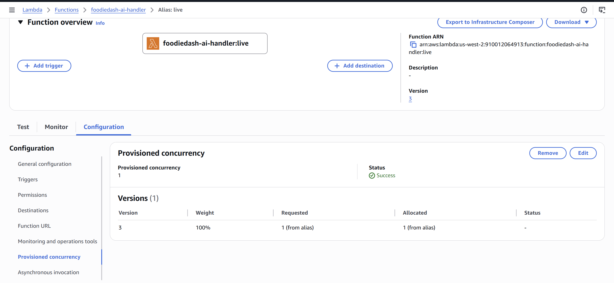
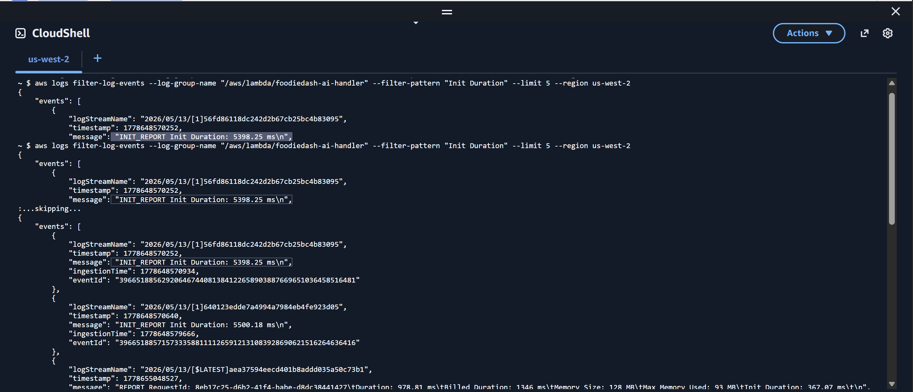
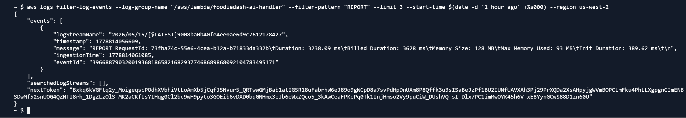
(CloudWatch trace AFTER Provisioned Concurrency — showing Init Duration = 0ms)

========================================
7. APPLICATION CARRY-FORWARD VERIFICATION
========================================

These screenshots prove the application built from W1–W4 is still running end-to-end on the W5 deployment.

7a. Application Running End-to-End:
- CloudFront FE: ✅ https://dywbriqynkljb.cloudfront.net — Deployed, Enabled
- ECS Service: ✅ Running 1/1
- DocumentDB: ✅ Available, 25 products
- Bedrock KB: ✅ ACTIVE, Data Source AVAILABLE
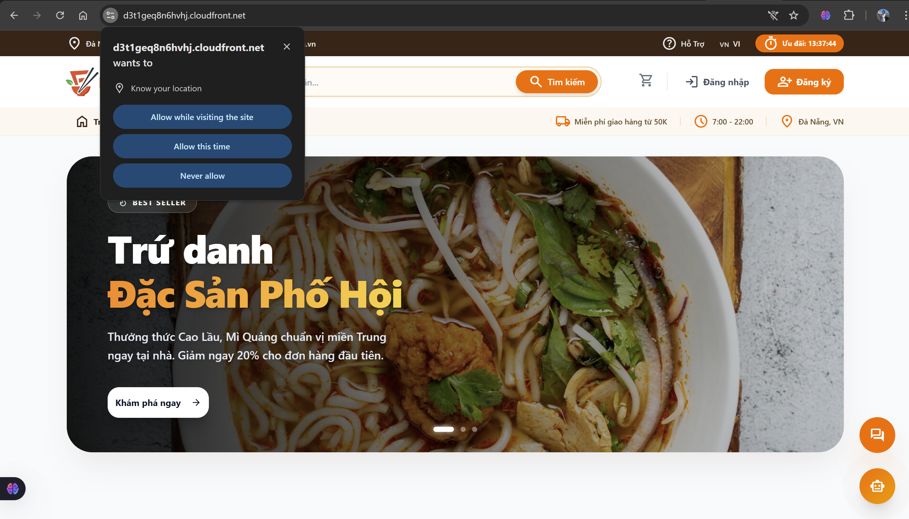

7b. Database Query — API Returning Real Data:
GET /api/products → {"success":true,"data":[...],"pagination":{"total":25}}
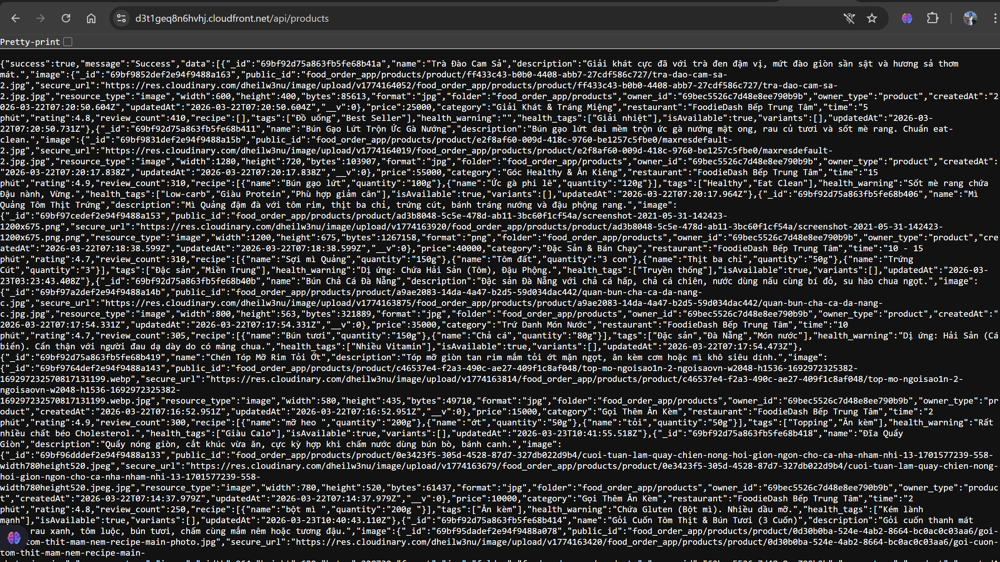

7c. Bedrock RAG Retrieval:
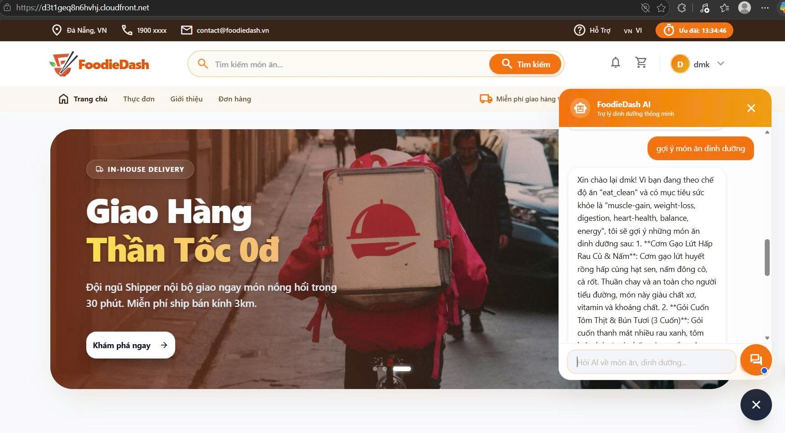

========================================
8. NEGATIVE SECURITY TESTS
========================================

At least one negative test per W5 addition, proving security controls are actively enforcing.

8a. MH1 — Flow Log REJECT Entry:
VPC Flow Logs capture rejected traffic, proving security groups are blocking unauthorized access.


8b. MH2 — Firewall Blocked Request:
A request to a non-allowlisted domain is dropped by Network Firewall. Visible in Alert Logs.

→ 📸 Insert screenshot: screenshots/neg_mh2_blocked.png (Network Firewall Alert Log showing dropped/blocked request)

8c. MH3 — EFS Mount Target SG Restriction:
EFS mount target Security Group only allows TCP 2049 from ECS task SG. Connection from any other source is rejected.
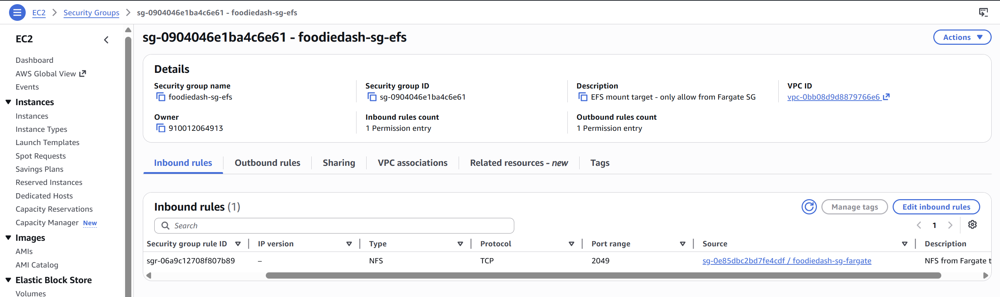

8d. MH4 — API Gateway 401/403 Rejection:
- No API key → 401: ✅ Request rejected
- Wrong API key → 403: ✅ Request rejected

8e. MH5 — Provisioned Concurrency Isolation:
Lambda function with Provisioned Concurrency does not consume unreserved account concurrency, protecting other functions.
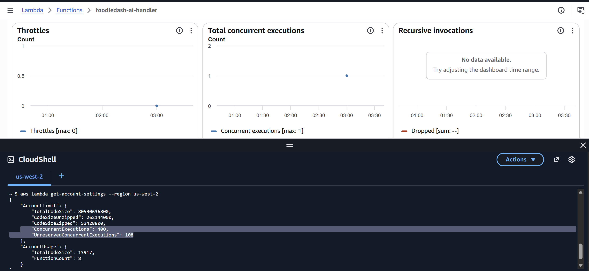

========================================
9. BONUS / STRETCH GOALS
========================================

9a. Infrastructure-as-Code with Terraform

All W5 infrastructure is provisioned and managed via Terraform, ensuring repeatable, version-controlled deployments.

Terraform project structure:
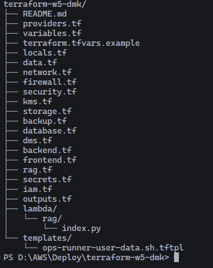

Terraform init — initializing providers and modules:
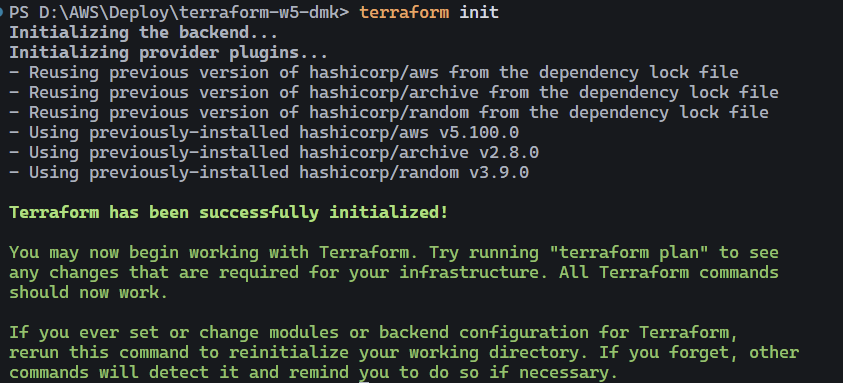

Terraform plan — previewing infrastructure changes before applying:
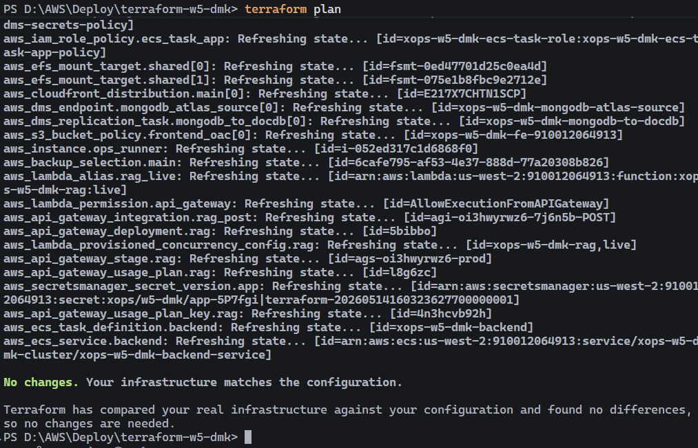

Terraform output — resource IDs and endpoints after successful apply:
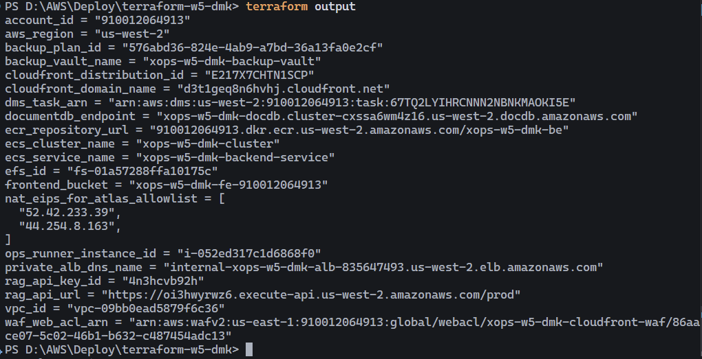

Key Terraform-managed resources for W5:
- VPC with subnet segmentation (public, private-app, private-db, firewall)
- AWS Network Firewall with stateful domain allowlist rule group
- EFS File System with access point, mount targets, and encryption
- API Gateway (HTTP API) with Lambda Authorizer and throttling
- Lambda function with Provisioned Concurrency (alias: live)
- AWS Backup vault and plan for EFS + DocumentDB
- Security Groups enforcing least-privilege access across all tiers

========================================
DEPLOYMENT SUMMARY
========================================

- Terraform apply: terraform apply -var-file=terraform.tfvars → ✅
- Docker build: docker build -t foodiedash-be . → ✅
- ECR push: docker push 910012064913.dkr.ecr.us-west-2.amazonaws.com/foodiedash-be:latest → ✅
- FE build: npm run build (Vite, 3373 modules) → ✅
- S3 sync: aws s3 sync dist/ s3://foodiedash-fe-910012064913/ --delete → ✅
- CloudFront invalidation: E33B8KW9AZSQ6S — /* → ✅
- ECS deployment: --force-new-deployment → Running: 1/1 → ✅


========================================
FINAL AUDIT
========================================

- MH1 VPC Flow Logs: ✅ ACTIVE, ALL traffic → CloudWatch
- MH2 Network Firewall: ✅ READY, 2 AZs, domain allowlist, Alert Logs
- MH3 EFS + Backup + Restore: ✅ All COMPLETED, data verified
- MH4 Lambda Authorizer: ✅ 401 / 403 / 200 verified
- MH5 Provisioned Concurrency: ✅ live alias, 1/1 READY
- ECS Service: ✅ Running 1/1
- CloudFront FE: ✅ Deployed, Enabled
- DocumentDB: ✅ Available, 25 products
- Bedrock KB: ✅ ACTIVE, DS AVAILABLE


Last updated: 2026-05-15
