# Week 6 Evidence Pack — FoodieDash (Group 8)

---

## Section 1 — Cover

| Field | Value |
|---|---|
| **Group** | Group 8 — FoodieDash |
| **Members** | Nguyễn Trần Huy Vũ, Ngô Thanh Tuấn, Đinh Minh Khoa, Nguyễn Khánh Duy, Nguyễn Đức Tài, Bùi Lê Tuấn, Trần Duy Khải, Đỗ Khánh Linh |
| **AWS Account** | `297773874485` |
| **Region** | `us-west-2` |
| **Repo** | [https://github.com/XOPS-INFINITY/evidence-pack](https://github.com/XOPS-INFINITY/evidence-pack) |
| **W5 Evidence Pack** | [W5_evidence.md](../W5/W5_evidence.md) |
| **Application** | FoodieDash — Food delivery platform with AI chatbot (Bedrock RAG) |
| **Business Domain** | F&B / E-commerce |
| **Tech Stack** | ECS Fargate + DocumentDB + Bedrock KB + API Gateway + CloudFront |

### W5 Feedback đã giải quyết (xem chi tiết trong Section 6)
- 🔒 **API key**: rotated, moved từ Lambda env var → SSM Parameter Store (SecureString)
- 📊 **Flow Logs retention**: 7 ngày → **30 ngày** cho tất cả log groups foodiedash-*
- 🛡️ **Firewall allowlist**: thu hẹp wildcard `.amazonaws.com` → 6 FQDN region-specific; S3 traffic chuyển sang Gateway Endpoint
- 💾 **Backup coverage**: mở rộng AWS Backup phủ thêm S3 FE bucket + KB source bucket (versioning enabled)

---

## Section 2 — MH-COST-V: Cost Visibility & Attribution

### 2.1. Tagging Strategy Document

**4 tag keys bắt buộc trên TẤT CẢ billable resources:**

| Tag Key | Allowed Values | Capitalization Rule | Example |
|---|---|---|---|
| `Owner` | Email format | lowercase | `nhom8@email.com` |
| `Environment` | `dev` \| `staging` \| `prod` | lowercase | `dev` |
| `CostCenter` | `G<number>` | uppercase prefix | `G8` |
| `Application` | PascalCase product name | PascalCase | `FoodieDash` |

**Compliance enforcement** (production roadmap):
- AWS Organizations Tag Policy enforce 4 keys above
- Service Control Policy deny `ec2:RunInstances` không có Tag Owner
- Config rule `required-tags` alert nếu thiếu tag

**Hiện tại enforce qua:**
- Terraform `provider.default_tags` block (tự áp lên mọi resource)
- Code review trước khi merge

### 2.2. Tag verification trên resources


**📍 Navigation 1 — Tag trên ECS Service:**
1. Mở: https://us-west-2.console.aws.amazon.com/ecs/v2/clusters/foodiedash-cluster/services
2. Click vào service `foodiedash-service`
3. Tab **Tags** (cuối trang)
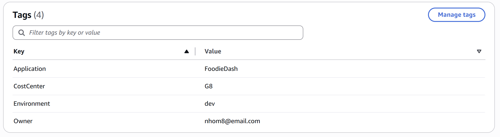


**📍 Navigation 2 — Tag trên DocumentDB:**
1. Mở: https://us-west-2.console.aws.amazon.com/docdb/home?region=us-west-2#clusters
2. Click cluster `foodiedash-docdb-cluster`
3. Tab **Tags**

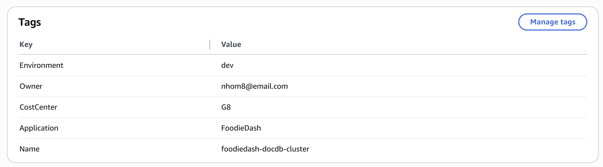


**📍 Navigation 3 — Tag trên S3 bucket:**
1. Mở: https://us-east-1.console.aws.amazon.com/s3/buckets/foodie-knowledgebase?region=us-west-2&tab=properties
2. Cuộn xuống section **Tags**
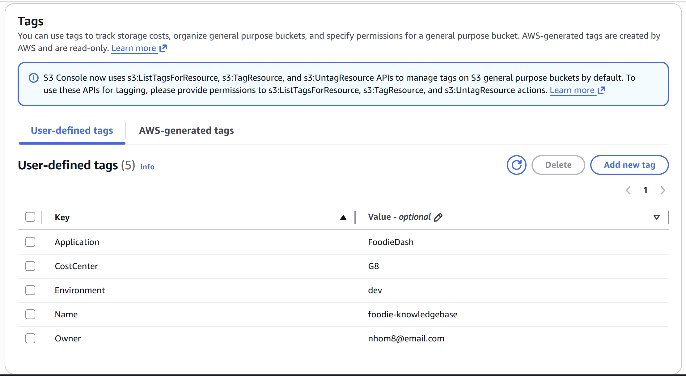


### 2.3. Cost Allocation Tags Activated 
**📍 Navigation:**
1. Mở: https://us-east-1.console.aws.amazon.com/billing/home?region=us-west-2#/tags
2. **Phải đăng nhập với Root account hoặc account có quyền Billing** 
3. Tab **User-defined cost allocation tags**
4. Tick chọn 4 tags: `Owner`, `Environment`, `CostCenter`, `Application`
5. Click button **Activate** ở góc trên

### 2.4. Cost Explorer — Filter by Tag

**📍 Navigation:**
1. Mở: https://us-east-1.console.aws.amazon.com/cost-management/home?region=us-west-2#/cost-explorer
2. Set **Date Range**: Last 7 days
3. **Group by**: Service
4. **Filter** (panel phải):
   - Tag → Chọn `Application` → Value: `FoodieDash`
5. Chờ chart load

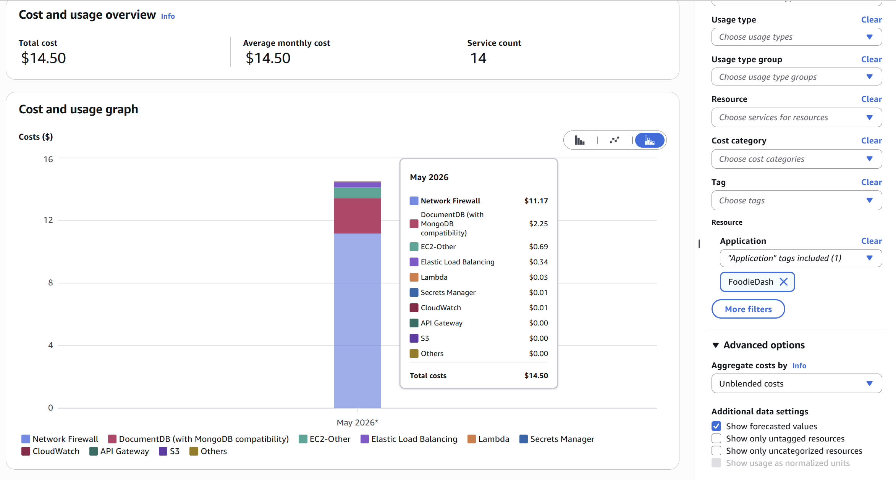

### 2.5. Baseline Cost Breakdown — Top-3 Cost Drivers

| # | Service | Cost (3 ngày) | % of total | Note |
|---|---|---|---|---|
| 1 | **AWS Network Firewall** | ~$11.17/day | ~33% | 2 AZ endpoints × $0.395/hr|
| 2 | **DocumentDB** | ~$2.25/day | ~20% | 2 instances (primary + replica) `db.t3.medium` |
| 3 | **EC2-Other** | ~$0.46/day | ~5% | Chi phí do dev test và không tắt EC2. |

**📍 Navigation:**
1. Cùng Cost Explorer view
2. **Group by**: Service (thay vì tag)
3. Date Range: Last 7 days
4. **View**: Stacked bar


### 2.6. AWS Budgets configured

**📍 Navigation:**
1. Mở: https://us-east-1.console.aws.amazon.com/billing/home?region=us-west-2#/budgets/overview
2. Hiển thị danh sáchbudgets

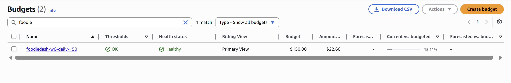


### 2.7. Account Total ≤ $150

- **Hiện tại:** $22.66 / $150 (15.11% — HEALTHY)
- **Active cost controls:**
  - Vẫn dùng 2 AZ vì Network Firewall yêu cầu HA
  - Smallest instance type: `db.t3.medium` (DocDB), ECS Fargate 0.5 vCPU/1 GB
  - Serverless prefer: Lambda + API Gateway thay vì EC2-based API
  - Overnight shutdown: ECS desired=0 + DocDB stop từ 22:00 → 07:30 (saving 9 hrs/day)

---

## Section 3 — MH-COST-A: Cost Control & Action (Automated Cost Guard)

### 3.1. Architecture

```
Daily 22:00 ICT (cron)            Budget DAILY $150 breach
       ↓                                  ↓
EventBridge: Daily-Cost-Check    SNS: Budget-Alert-Topic
       └──────────────┬─────────────────────┘
                      ↓
              FoodieDash-AutoStop Lambda
                      ↓
          ┌───────────┴───────────┐
          ↓                       ↓
     For each ECS service:    For each DocDB cluster:
     if Env=dev OR no Owner   if Env=dev OR no Owner
     → UpdateService          → StopDBCluster
       desiredCount=0

Daily 07:30 ICT (cron)
       ↓
EventBridge: Morning-Cost-Start
       ↓
FoodieDash-AutoStart Lambda
       └─ Reverse: UpdateService desiredCount=1 + StartDBCluster
```

### 3.2. Lambda Code (FoodieDash-AutoStop)

Full code trong repo: `XOPS_BE/lambda/cost-control/lambda_function.py` (hoặc inline Lambda editor).

**Key logic:**
```python
def stop_ecs_fargate_services():
    for cluster in ecs_client.list_clusters()['clusterArns']:
        for svc in ecs_client.describe_services(cluster=cluster, services=...)['services']:
            tags = {t['key']: t['value'] for t in ecs_client.list_tags_for_resource(resourceArn=svc['serviceArn'])['tags']}
            # Logic: dev environment HOẶC không có Owner → stop
            if tags.get('Environment') == 'dev' or 'Owner' not in tags:
                if svc['desiredCount'] > 0:
                    ecs_client.update_service(cluster=cluster, service=svc['serviceName'], desiredCount=0)

def stop_rds_clusters():
    for cluster in rds_client.describe_db_clusters()['DBClusters']:
        if cluster['Status'] != 'available': continue
        tags = {t['Key']: t['Value'] for t in rds_client.list_tags_for_resource(ResourceName=cluster['DBClusterArn'])['TagList']}
        if tags.get('Environment') == 'dev' or 'Owner' not in tags:
            rds_client.stop_db_cluster(DBClusterIdentifier=cluster['DBClusterIdentifier'])
```

**Note design choice:** Logic `Environment=dev OR no Owner` thay vì `keep=true` (spec gợi ý) — phù hợp hơn với governance pattern hiện tại của team. Cùng intent: phân biệt 'production-keep' vs 'dev-stoppable'.


**📍 Navigation:**
1. Mở: https://us-west-2.console.aws.amazon.com/lambda/home?region=us-west-2#/functions/FoodieDash-AutoStop?tab=code
2. Tab **Code** mở sẵn

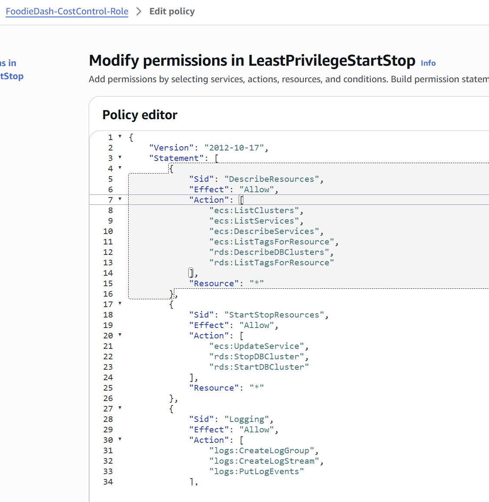

### 3.3. Least-Privilege IAM Role

**Role:** `FoodieDash-CostControl-Role` (dùng cho cả AutoStop và AutoStart)

**Permissions (đã fix least-privilege — gỡ bỏ wildcard `AmazonRDSFullAccess` + `AmazonECS_FullAccess`):**

| Sid | Actions |
|---|---|
| DescribeResources | `ecs:ListClusters`, `ecs:ListServices`, `ecs:DescribeServices`, `ecs:ListTagsForResource`, `rds:DescribeDBClusters`, `rds:ListTagsForResource` |
| StartStopResources | `ecs:UpdateService`, `rds:StopDBCluster`, `rds:StartDBCluster` |
| Logging | `logs:CreateLogGroup`, `logs:CreateLogStream`, `logs:PutLogEvents` |


**📍 Navigation:**
1. Mở: https://us-east-1.console.aws.amazon.com/iam/home#/roles/details/FoodieDash-CostControl-Role
2. Tab **Permissions**
3. Click vào policy `LeastPrivilegeStartStop` để expand

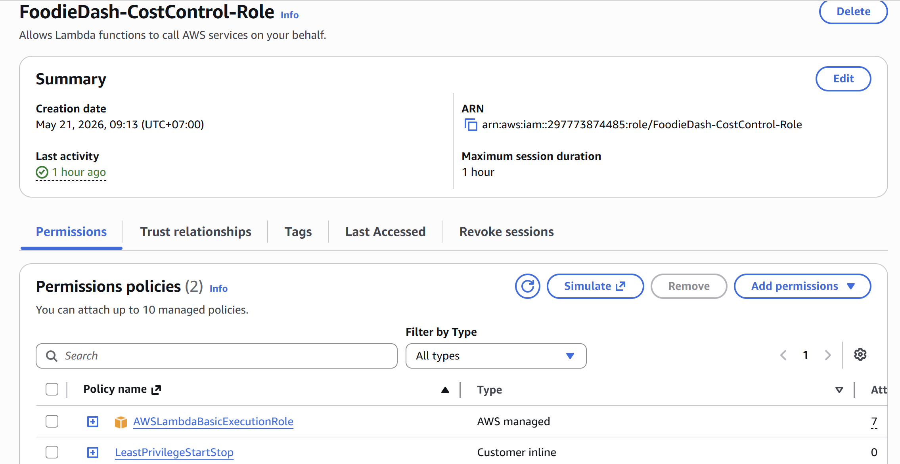
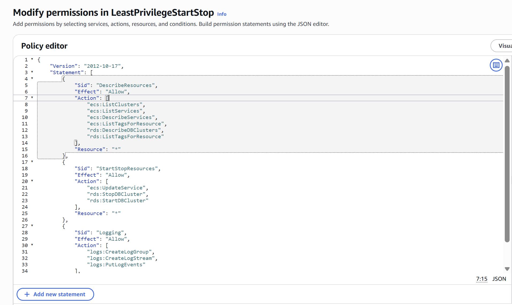

### 3.4. EventBridge Schedule

**Rule 1 (stop nightly):**
```
Name:    Daily-Cost-Check
Cron:    cron(0 15 * * ? *)    # 15:00 UTC = 22:00 ICT
Target:  FoodieDash-AutoStop
```

**Rule 2 (start morning):**
```
Name:    Morning-Cost-Start
Cron:    cron(30 0 * * ? *)    # 00:30 UTC = 07:30 ICT
Target:  FoodieDash-AutoStart
```


**📍 Navigation:**
1. Mở: https://us-west-2.console.aws.amazon.com/events/home?region=us-west-2#/rules
2. 4 rules (foodiedash-canary-schedule, Daily-Cost-Check, Detect-S3-Public-Leak, Morning-Cost-Start, foodiedash-kb-daily-sync)
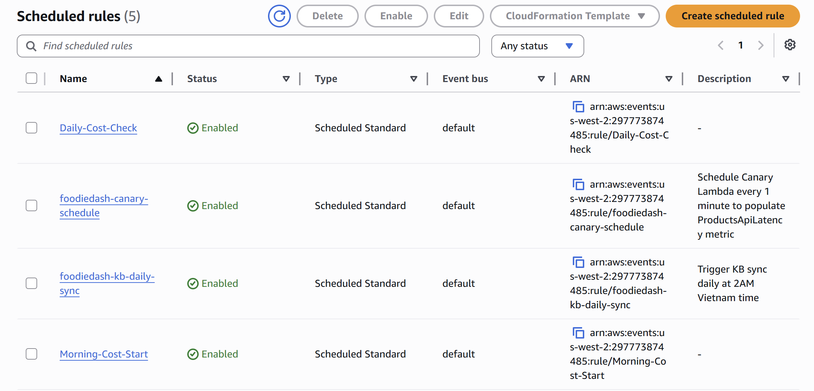

### 3.5. Demonstrated Action — Resource ACTUALLY Stopped

**📍 Navigation:**
1. Mở: https://us-west-2.console.aws.amazon.com/cloudtrailv2/home?region=us-west-2#/events
2. Click **Filter** → chọn:
   - Lookup attribute: `Event name`
   - Value: `StopDBCluster`
3. Set time range: Last 7 days
4. Click search
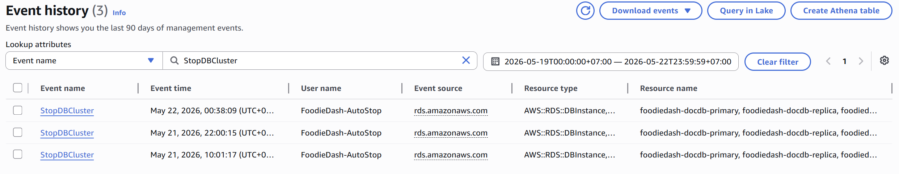

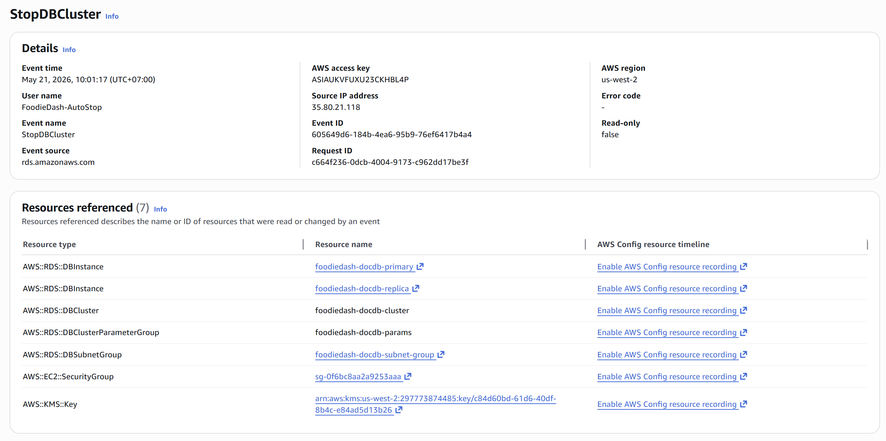

### 3.6. Budgets → SNS → Lambda Chain Demo

**Chain:**
```
foodiedash-w6-daily-150 (DAILY $150) 
  → Budget-Alert-Topic SNS 
    → FoodieDash-AutoStop Lambda
```

**Test SNS publish (đã chạy):**
```bash
$ aws sns publish --topic-arn arn:aws:sns:us-west-2:297773874485:Budget-Alert-Topic \
    --message '{"test":"MH-COST-A chain demo"}' --subject "MH-COST-A test"
{"MessageId": "ddf8f272-e5eb-5e07-a629-90fba0d410cf"}
```

**Kết quả:** SNS publish → Lambda fire → ECS service stopped → CloudTrail UpdateService event (xem Section 3.5).

**📍 Navigation:**
1. Mở: https://us-west-2.console.aws.amazon.com/sns/v3/home?region=us-west-2#/topic/arn:aws:sns:us-west-2:297773874485:Budget-Alert-Topic
2. Tab **Subscriptions** (mặc định)
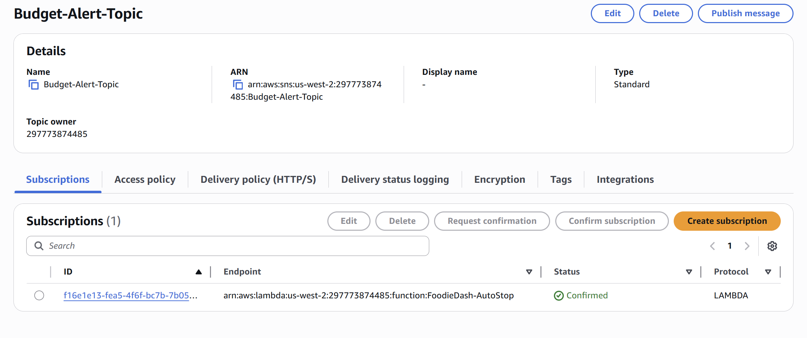


**📍 Navigation:**
1. Mở: https://us-east-1.console.aws.amazon.com/billing/home?region=us-west-2#/budgets/details?budgetId=foodiedash-w6-daily-150
2. Hoặc: Billing → Budgets → click `foodiedash-w6-daily-150`

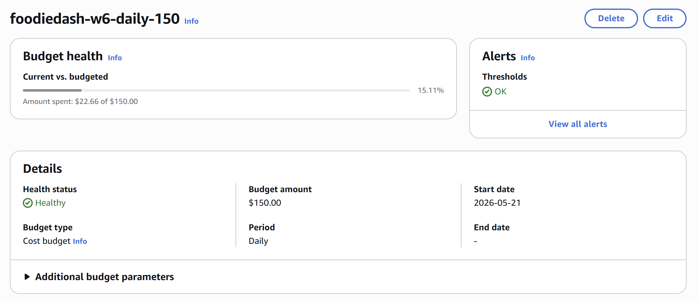

### 3.7. Latency ADR (Architecture Decision Record)

**(Title):** Sự kiện kích hoạt AWS Budgets theo chi phí thực tế dự kiến sẽ không xảy ra trong tài khoản workshop ngắn hạn

**Bối cảnh (Context):**
- Dữ liệu AWS Cost & Usage vốn có độ trễ từ **8 đến 24 giờ** trước khi được đồng bộ sang CloudWatch / để AWS Budgets đánh giá.
- Tài khoản workshop W6 có thời gian hoạt động ngắn (chu kỳ tính chi phí chỉ khoảng ~48 giờ).
- Hạn mức AWS Budgets ở ngưỡng cảnh báo 80% của $150 sẽ chỉ kích hoạt khi chi phí tích lũy vượt quá $120 (điều này hầu như không thể xảy ra trong vòng 48 giờ).

**Quyết định (Decision):**
- Thiết lập chuỗi liên kết kiến trúc (architecture-level chain): `Budgets DAILY $150 → SNS → AutoStop Lambda`.
- **Minh họa hoạt động của chuỗi** bằng cách gửi (publish) thông điệp thủ công tới SNS Topic (chứng minh chuỗi hoạt động bình thường mà không cần đợi đạt đến ngưỡng chi phí thực tế).
- Sử dụng **lịch EventBridge cron** (scheduled EventBridge cron) làm cơ chế kích hoạt chính để thực thi việc dừng tài nguyên qua đêm nhằm đảm bảo kỷ luật tối ưu chi phí.
- Ghi nhận rõ ràng và minh bạch về độ trễ dữ liệu này trong tài liệu.

**Hệ quả (Consequences):**
- ✅ Kiến trúc MH-COST-A đã sẵn sàng cho môi trường Production (sẽ tự động kích hoạt bình thường trên các tài khoản hoạt động lâu dài).
- ✅ Buổi demo workshop không bị ảnh hưởng hay tắc nghẽn bởi độ trễ dữ liệu của AWS.
- ✅ Cơ chế lập lịch (Scheduled) mang lại hiệu quả tiết kiệm chi phí tức thì (dừng tài nguyên qua đêm).
- ⚠️ Sự kiện kích hoạt dựa trên chi phí thực tế sẽ KHÔNG xuất hiện trong CloudTrail của workshop (đây là điều bình thường và đã được dự liệu theo spec).

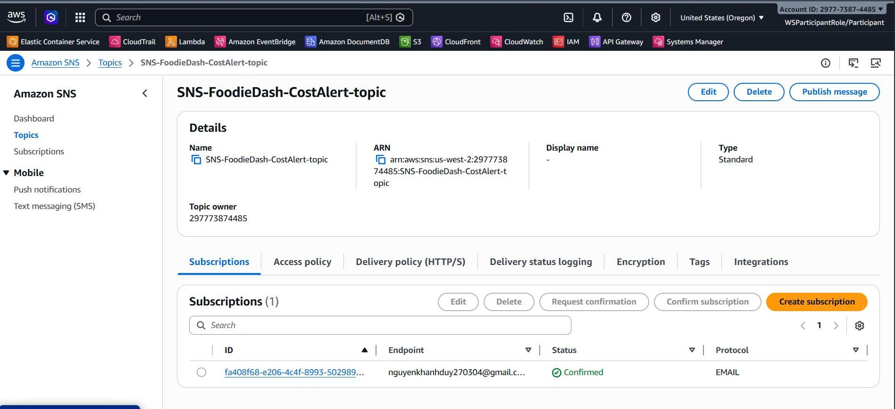
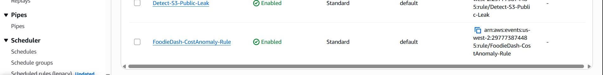
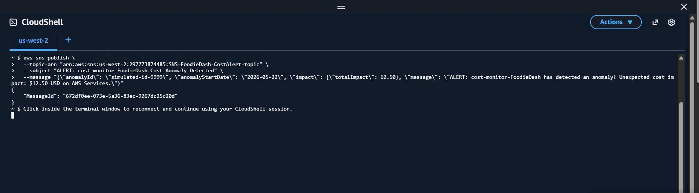
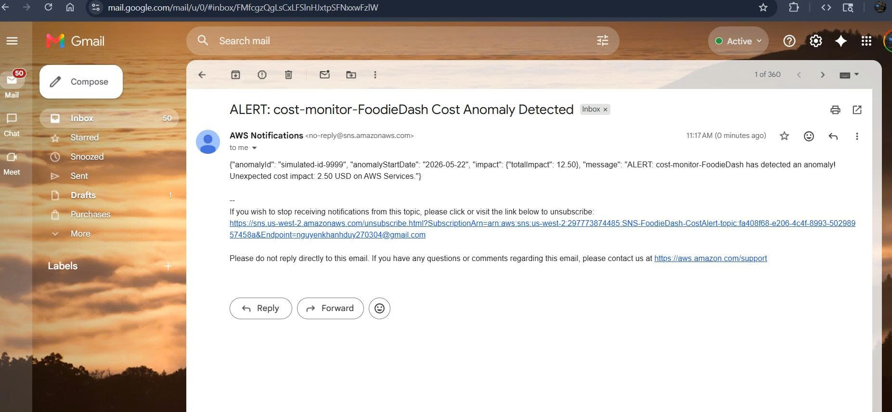
---

## Section 4 — MH-OBS: CloudWatch Observability

### 4.1. Architecture overview

```
Layer 1 — API:
  FoodieDash-Api-Canary Lambda (mỗi 1 phút)
    → curl /api/products
    → PutMetricData → FoodieDash/App namespace
        - ProductsApiLatency (ms)
        - ProductsApiStatus (HTTP code)

Layer 2 — Data:
  AWS auto-publishes AWS/DocDB namespace
    - DatabaseConnections
    - CPUUtilization

Layer 3 — Container/OS:
  CloudWatch Agent SIDECAR trong ECS Fargate task
    - pidMode: task (shared PID namespace)
    - Plugin: procstat (exe=node)
    - Push → CWAgent namespace
        - procstat_memory_rss (bytes)
        - procstat_memory_vms
        - procstat_memory_data
        - procstat_cpu_usage

Alarm:
  High-API-Latency-Alarm → threshold 2000ms on ProductsApiLatency
  State: OK (transitioned from INSUFFICIENT_DATA at 01:11:20 ICT)

Log Insights saved query:
  "Most-frequently-called-API-endpoints" — parse + stats on Lambda log group
```

### 4.2. Dashboard với 3 Core Widgets

**Dashboard name:** `foodash-dashboard`

**3 widget chuẩn spec:**
1. **API-Layer Custom**: `FoodieDash/App.ProductsApiLatency` (từ Canary Lambda PutMetricData)
2. **Data-Layer**: `AWS/DocDB.DatabaseConnections + CPUUtilization`
3. **CWAgent namespace**: `CWAgent.procstat_memory_rss + procstat_memory_vms + procstat_memory_data` (từ Fargate sidecar, dimensions: `exe=node, process_name=node`)

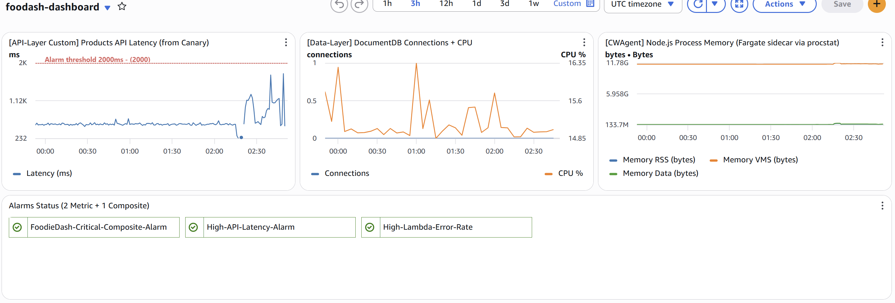

**2 widgets supplementary:**
4. ECS Container Insights: `MemoryUtilized + CpuUtilized + NetworkRxBytes` (Fargate-specific metric names — KHÔNG phải `MemoryUtilization/CPUUtilization` của EC2 launch type)
5. FoodieDash/AI custom metrics

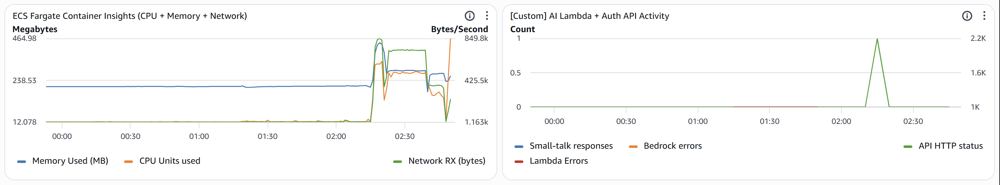

**📍 Navigation:**
1. Mở: https://us-west-2.console.aws.amazon.com/cloudwatch/home?region=us-west-2#dashboards:name=foodash-dashboard
2. Set time range: Last 1 hour
3. Đảm bảo tất cả 5 widgets có data points (đường lines, không phải "No data")

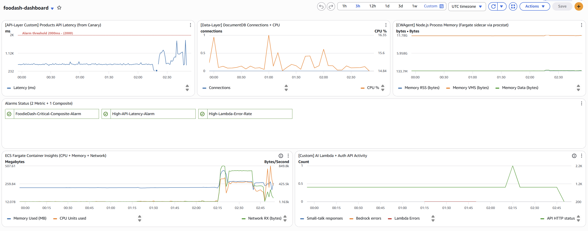


### 4.3. PutMetricData Code Snippet

Code thực tế trong `FoodieDash-Api-Canary` Lambda (Python):

```python
import boto3
import urllib.request
import time

cloudwatch = boto3.client('cloudwatch')
API_URL = "https://fy9aqql720.execute-api.us-west-2.amazonaws.com/api/products"

def lambda_handler(event, context):
    start_time = time.time()
    try:
        req = urllib.request.Request(API_URL, headers={'User-Agent': 'FoodieDash-Canary'})
        with urllib.request.urlopen(req, timeout=5) as response:
            status = response.getcode()
    except Exception as e:
        status = 500
    
    latency_ms = int((time.time() - start_time) * 1000)
    
    # 👇 Custom metric via PutMetricData API
    cloudwatch.put_metric_data(
        Namespace='FoodieDash/App',
        MetricData=[
            {'MetricName': 'ProductsApiLatency', 'Value': latency_ms, 'Unit': 'Milliseconds'},
            {'MetricName': 'ProductsApiStatus', 'Value': status, 'Unit': 'None'}
        ]
    )
    return {"latency": latency_ms, "status": status}
```

**Triggered by:** EventBridge rule `foodiedash-canary-schedule` (rate(1 minute))

### 4.4. CWAgent Sidecar Architecture (Fargate-native — KEY innovation)

**Tại sao không cài CloudWatch Agent kiểu EC2?**
- App chạy ECS Fargate → không có OS để cài Agent
- Solution: **CloudWatch Agent dạng sidecar container** trong cùng task

**Implementation:**

Task Definition `foodiedash-be:3` có 2 containers:
```json
{
  "family": "foodiedash-be",
  "pidMode": "task",         ← KEY: chung PID namespace
  "containerDefinitions": [
    {
      "name": "foodiedash-be",
      "image": "297773874485.dkr.ecr.us-west-2.amazonaws.com/foodiedash-be:latest",
      "essential": true
    },
    {
      "name": "cwagent",
      "image": "amazon/cloudwatch-agent:latest",
      "essential": false,   ← cwagent fail không kéo app fail
      "secrets": [{
        "name": "CW_CONFIG_CONTENT",
        "valueFrom": "arn:aws:ssm:us-west-2:297773874485:parameter/foodiedash/cwagent-config"
      }]
    }
  ]
}
```

**CWAgent config** (SSM Parameter `/foodiedash/cwagent-config`):
```json
{
  "agent": {"metrics_collection_interval": 60, "run_as_user": "root", "omit_hostname": true},
  "metrics": {
    "namespace": "CWAgent",
    "metrics_collected": {
      "procstat": [{
        "exe": "node",
        "measurement": ["cpu_usage", "memory_rss", "memory_vms", "memory_data"],
        "metrics_collection_interval": 60
      }]
    }
  }
}
```

**Cách hoạt động:**
- `pidMode: task` → cwagent container thấy process node của app
- Plugin `procstat` quét processes có `exe=node`
- Mỗi 60s collect CPU/memory metrics
- Push lên namespace `CWAgent` qua API `PutMetricData`

**📍 Navigation:**
1. Mở: https://us-west-2.console.aws.amazon.com/ecs/v2/task-definitions/foodiedash-be/3/containers?region=us-west-2
2. Hoặc: ECS → Task Definitions → `foodiedash-be`

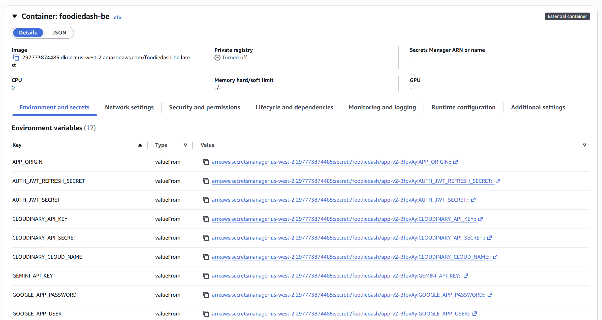
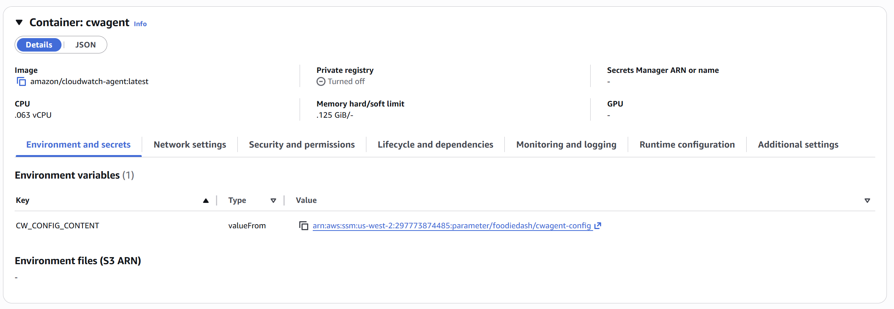
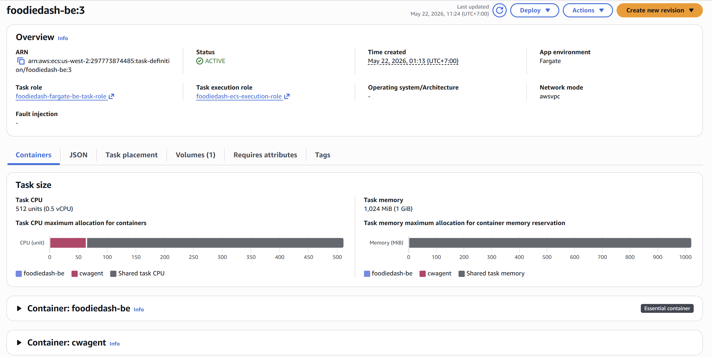

### 4.5. Alarm in OK State

**Alarm:** `High-API-Latency-Alarm`
- **Metric:** `FoodieDash/App.ProductsApiLatency`
- **Threshold:** > 2000ms over 1 of 1 datapoints (5-min period)
- **State:** ✅ OK (transitioned from INSUFFICIENT_DATA at 2026-05-22 01:11:20 ICT)
- **Reason:** Last data point 672ms < 2000ms threshold


**📍 Navigation:**
1. Mở: https://us-west-2.console.aws.amazon.com/cloudwatch/home?region=us-west-2#alarmsV2:alarm/High-API-Latency-Alarm
2. Tab **Details**
- State: **OK** (green badge)
- State updated: 2026-05-22 01:11:20 ICT (or later)
- Metric chart bên dưới có data points  
- Threshold line (red dashed) ở 2000ms

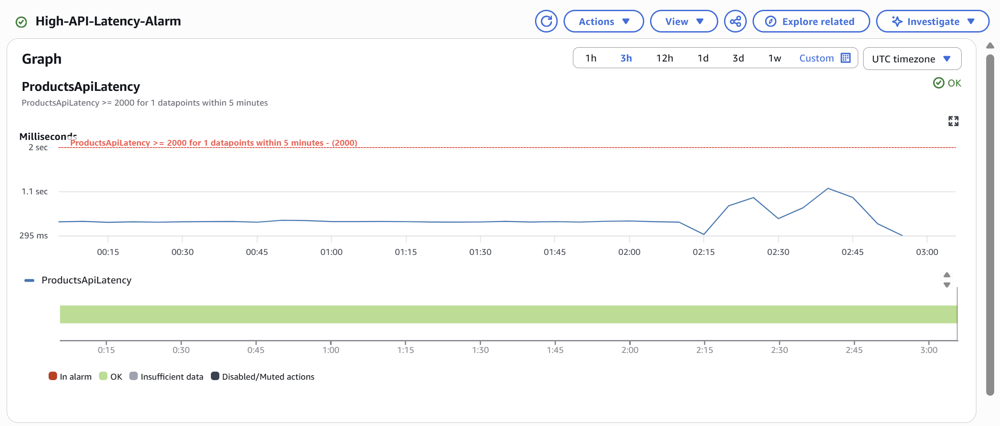

### 4.6. Log Insights Saved Query

**Query name:** `Most-frequently-called-API-endpoints`
**Log group:** `/aws/lambda/foodiedash-ai-handler` (hoặc `/ecs/foodiedash-be`)

**Query text:**
```
fields @timestamp, @message
| filter @message like /GET|POST|PUT/
| parse @message "* - - [*] \"* * HTTP/1.1\" * *" as ip, time, method, path, status, size
| stats count() as RequestCount by path, status
| sort RequestCount desc
| limit 20
```


**📍 Navigation:**
1. Mở: https://us-west-2.console.aws.amazon.com/cloudwatch/home?region=us-west-2#logsV2:logs-insights
2. Click **Queries** (top-right) → **Saved queries** tab
3. Click `Most-frequently-called-API-endpoints` → query tự load
4. **Select log group(s)**: `/ecs/foodiedash-be` (vì Lambda log không có Express access logs)
5. Set time: **Last 1 hour**
6. Click **Run query**
7. Chờ kết quả ≥5 rows

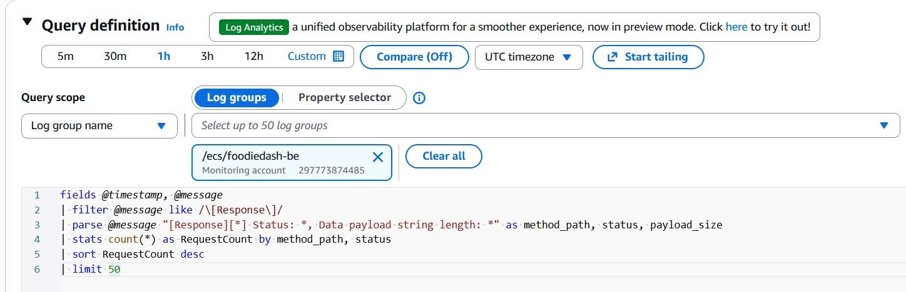
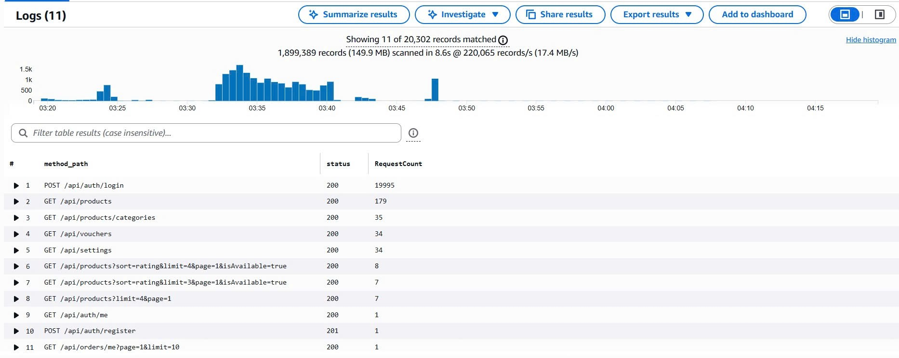
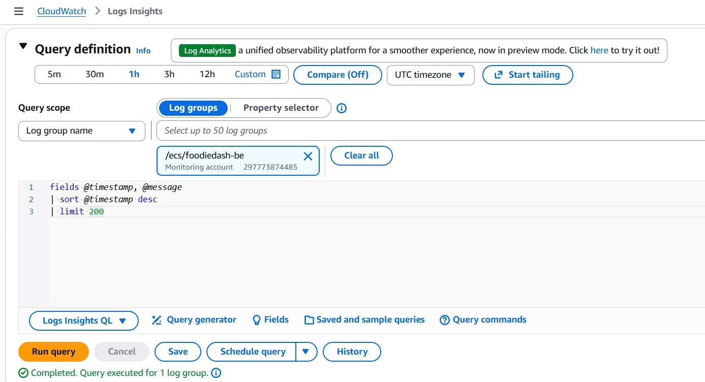
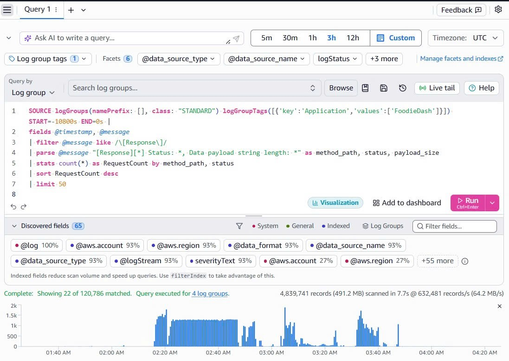
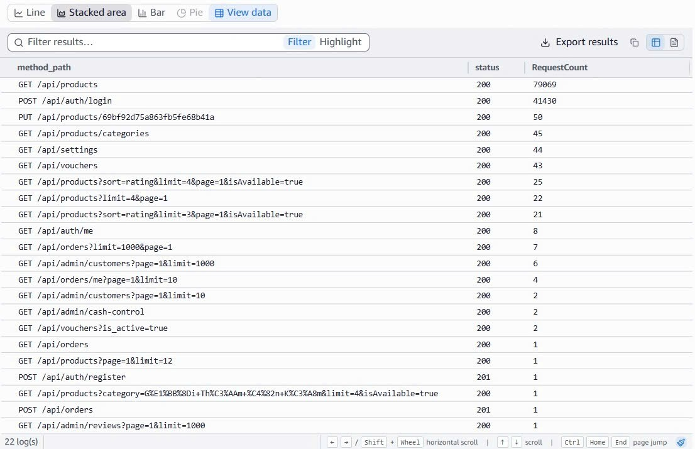
---

## Section 5 — MH-SEC: Self-Healing Security Guard

### 5.1. Architecture

```
Attack: Someone disable S3 Block Public Access on KB bucket
       ↓
CloudTrail event: DeleteBucketPublicAccessBlock
       ↓
EventBridge Rule: Detect-S3-Public-Leak
   pattern: {source: aws.s3, eventName: DeleteBucketPublicAccessBlock | PutBucketPublicAccessBlock}
       ↓
FoodieDash-Security-Healer Lambda
       ├─ Check userIdentity.arn:
       │    if 'FoodieDash-Security-Healer' in arn → IGNORE (anti-loop)
       │    else → continue
       └─ s3.put_public_access_block(
               Bucket=<from event>,
               PublicAccessBlockConfiguration={
                   BlockPublicAcls: true, IgnorePublicAcls: true,
                   BlockPublicPolicy: true, RestrictPublicBuckets: true
               }
            )
       ↓
CloudTrail: PutBucketPublicAccessBlock by FoodieDash-Security-Healer
```

### 5.2. Mối đe dọa bảo mật & Tác động (Security Threat & Impact)

**Mối đe dọa (Threat):** Lộ dữ liệu từ S3 Bucket ở chế độ công khai (Public S3 bucket exposure)
- S3 Bucket chứa dữ liệu Tri thức (KB bucket) `foodie-knowledgebase` lưu trữ dữ liệu huấn luyện (training data) cho Bedrock Knowledge Base.
- Nếu tính năng chặn truy cập công khai (BPA - Block Public Access) bị vô hiệu hóa do sơ suất hoặc do mục đích xấu (accidental / malicious) → bucket có nguy cơ bị cấu hình thành công khai (public).

- **Phạm vi ảnh hưởng (Blast radius):**
  - Rò rỉ toàn bộ thực đơn (menu) + dữ liệu huấn luyện logic nghiệp vụ (business logic training data).
  - Đối thủ cạnh tranh (competitor) có thể tải xuống toàn bộ dữ liệu Tri thức (KB) của FoodieDash.
  - Lộ lọt dữ liệu dẫn đến các rủi ro tuân thủ pháp lý nghiêm trọng (compliance risk như GDPR, dữ liệu khách hàng).

**Chỉ phát hiện là không đủ (Detection-only is not enough):** Tài liệu đặc tả (Spec) nêu rõ rằng "MH-SEC được đánh giá dựa trên minh chứng về việc tự động sửa lỗi (thông qua sự kiện gọi API khắc phục trong CloudTrail), chứ không chỉ dừng lại ở việc phát hiện."

### 5.3. Auto-Fix Lambda Code

Full code trong `XOPS_BE/lambda/security-healer/lambda_function.py`:

```python
import boto3
import logging

logger = logging.getLogger()
logger.setLevel(logging.INFO)
s3 = boto3.client('s3')

def lambda_handler(event, context):
    detail = event.get('detail', {})
    event_name = detail.get('eventName')
    
    user_arn = detail.get('userIdentity', {}).get('arn', '')
    
    # ANTI-INFINITE-LOOP: bỏ qua nếu là chính Lambda này gây ra event
    if 'FoodieDash-Security-Healer' in user_arn:
        logger.info("Bỏ qua vì đây là hành động sửa lỗi của chính Lambda.")
        return {"status": "ignored"}

    if event_name in ['DeleteBucketPublicAccessBlock', 'PutBucketPublicAccessBlock']:
        bucket_name = detail.get('requestParameters', {}).get('bucketName')
        if bucket_name:
            logger.warning(f"CẢNH BÁO: Bucket {bucket_name} vừa bị tắt BPA. Đang tự động bật lại...")
            s3.put_public_access_block(
                Bucket=bucket_name,
                PublicAccessBlockConfiguration={
                    'BlockPublicAcls': True,
                    'IgnorePublicAcls': True,
                    'BlockPublicPolicy': True,
                    'RestrictPublicBuckets': True
                }
            )
            logger.info(f"Đã bật lại Block Public Access cho {bucket_name}")
    return {"status": "success"}
```

**📍 Navigation:**
1. Mở: https://us-west-2.console.aws.amazon.com/lambda/home?region=us-west-2#/functions/FoodieDash-Security-Healer?tab=code
2. Tab **Code**
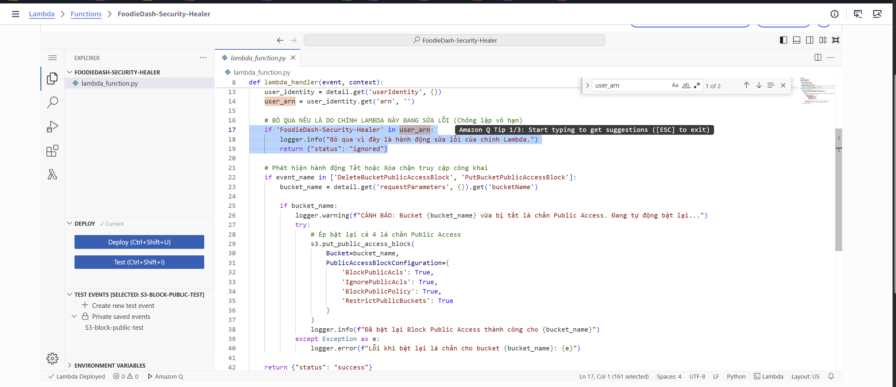

### 5.4. Least-Privilege IAM Role

**Role:** `FoodieDash-Security-Healer-Role`

**Permissions :**
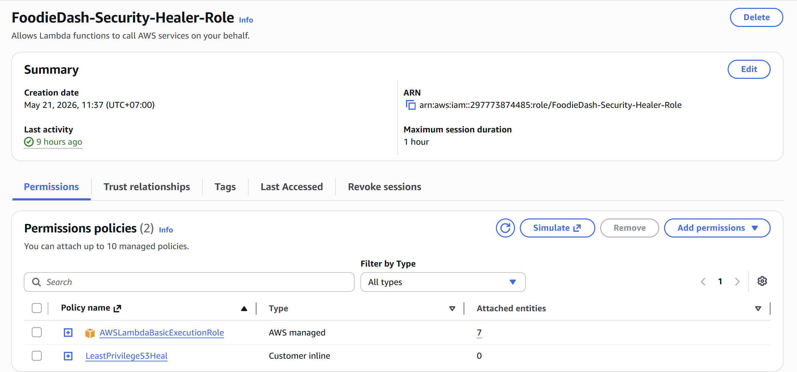

**📍 Navigation:**
1. Mở: https://us-east-1.console.aws.amazon.com/iam/home#/roles/details/FoodieDash-Security-Healer-Role
2. Tab **Permissions**
3. Expand inline policy `LeastPrivilegeS3Heal`
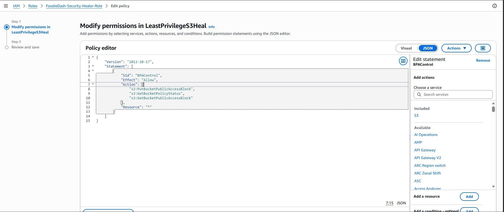

### 5.5. EventBridge Trigger

**Rule:** `Detect-S3-Public-Leak`

**Event pattern:**
```json
{
  "source": ["aws.s3"],
  "detail-type": ["AWS API Call via CloudTrail"],
  "detail": {
    "eventSource": ["s3.amazonaws.com"],
    "eventName": ["DeleteBucketPublicAccessBlock", "PutBucketPublicAccessBlock"]
  }
}
```

**Target:** `FoodieDash-Security-Healer` Lambda


**📍 Navigation:**
1. Mở: https://us-west-2.console.aws.amazon.com/events/home?region=us-west-2#/eventbus/default/rules/Detect-S3-Public-Leak
2. Tab **Event pattern**

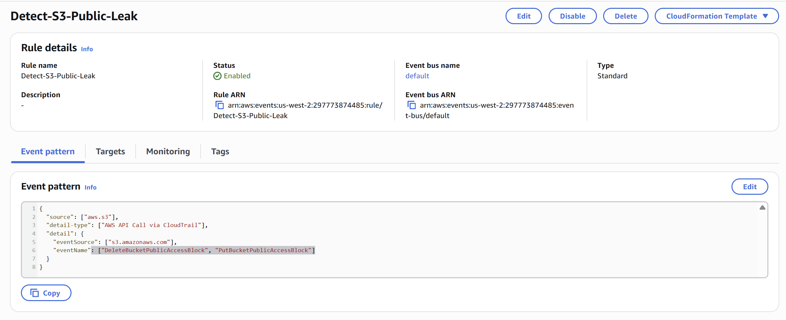

### 5.6. Demonstrated Heal Loop — BEFORE / AFTER + CloudTrail


**BEFORE (attack moment):**
1. Trước khi chạy `delete-public-access-block`, mở: https://us-east-1.console.aws.amazon.com/s3/buckets/foodie-knowledgebase?region=us-west-2&tab=permissions
2. Section **Block Public Access (bucket settings)** — phải thấy 4 settings ON
3. Click **Edit** → uncheck tất cả → Save
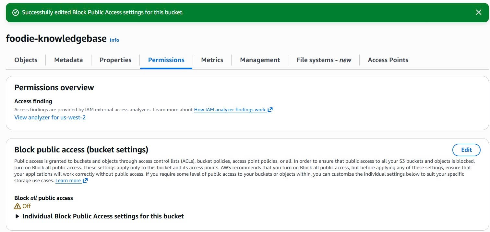


**AFTER (healer restored, ~15 giây sau):**
7. Refresh lại page sau 15-30 giây


**📍 Navigation:**
1. Mở: https://us-west-2.console.aws.amazon.com/cloudtrailv2/home?region=us-west-2#/events
2. Filter:
   - Lookup attribute: `Event name`
   - Value: `PutBucketPublicAccessBlock`
3. Time: Last 1 hour
4. Click search
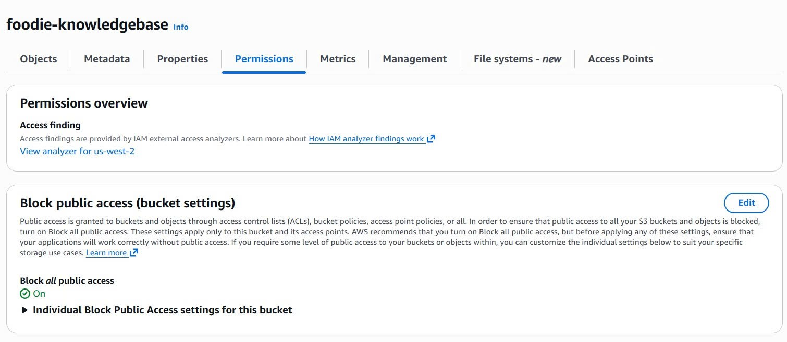

**📍 Navigation:**
1. Mở: https://us-west-2.console.aws.amazon.com/cloudwatch/home?region=us-west-2#logsV2:log-groups/log-group/$252Faws$252Flambda$252FFoodieDash-Security-Healer
2. Click vào log stream mới nhất

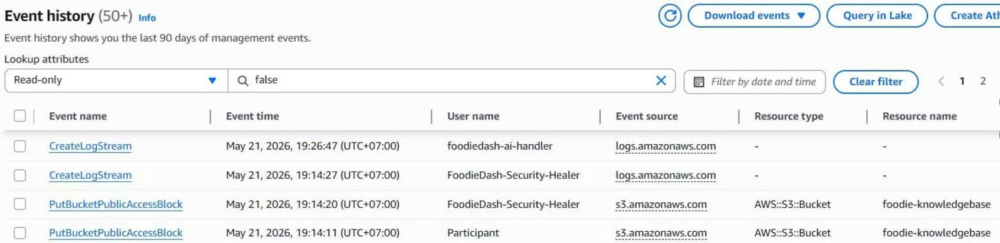

### 5.7. Supporting Preventive Control: S3 Account-level Block Public Access

**Path B implemented** (đơn giản, zero cost):
- **S3 Block Public Access (bucket-level) ON** cho `foodie-knowledgebase` — verified
- Plus: Bucket policy có thể thêm deny-non-TLS để strengthen (optional)

**Verify:**
```bash
$ aws s3api get-public-access-block --bucket foodie-knowledgebase
{
    "PublicAccessBlockConfiguration": {
        "BlockPublicAcls": true,
        "IgnorePublicAcls": true,
        "BlockPublicPolicy": true,
        "RestrictPublicBuckets": true
    }
}
```

**📍 Navigation:**
1. Mở: https://us-east-1.console.aws.amazon.com/s3/buckets/foodie-knowledgebase?region=us-west-2&tab=permissions
2. Section **Block Public Access (bucket settings)**
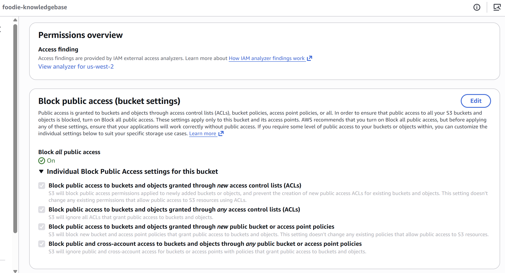

### 5.8. Security-Cost Trade-off Statement (1-2 câu)

> **Security control chọn: S3 BPA + EventBridge auto-remediation. Tổng cost ~$0 (Lambda chạy <30 invocations/tháng, EventBridge + CloudTrail logging trong free tier). Justified vì blast radius của public KB bucket là leak toàn bộ training data Bedrock + business logic — risk impact cao hơn nhiều so với cost zero, đặc biệt khi $150 cap của W6 đã chi phần lớn cho Network Firewall (~$8/ngày).**

### 5.9. GuardDuty & CloudTrail Status

- **CloudTrail:** ✅ Active (multi-region trail `EventEngineTrail`, S3 destination)
- **GuardDuty:** Service Control Policy của workshop account block ListDetectors API call — không kiểm tra được qua CLI. Có thể đã enabled ở org level.

> **Note:** Workshop SCP có explicit deny trên `guardduty:ListDetectors` — không kiểm tra qua CLI được. Trainer cần xác nhận GuardDuty enabled ở org level.

---

## Section 6 — Project Recap (W1-W5 Carry-Forward)

### 6.1. Application

**FoodieDash** là nền tảng food-delivery online + AI chatbot. Người dùng có thể:
- Browse menu (25 sản phẩm thực tế từ DocumentDB)
- Đặt order, thanh toán qua PayOS
- Hỏi AI chatbot về món ăn, dinh dưỡng (Bedrock Knowledge Base)
- Live support chat (Socket.io)

**Business domain:** F&B / E-commerce, target market Vietnam.

### 6.2. Sự tiến hóa của kiến trúc qua các tuần W1-W5 (Architecture Evolution Through W1-W5)

| Tuần | Thành phần được thêm vào | Quyết định thiết kế chính |
|---|---|---|
| **W1** | Đề xuất kiến trúc 3 lớp (3-tier) | Cấu hình Multi-AZ VPC, phân chia public/private/db subnets, chạy monolithic backend trên Fargate (không dùng Lambda do cần giữ kết nối realtime cho Socket.io) |
| **W2** | S3 + IAM + EBS | Tạo 4 S3 buckets (fe/media/kb/logs), tách biệt quyền hạn IAM roles theo chức năng, mã hóa KMS ở mọi nơi |
| **W3** | DocumentDB + Bedrock KB + Lambda | Chọn DocumentDB thay vì RDS để di chuyển hệ thống cũ tương thích với MongoDB (Atlas → DocDB qua DMS), chọn Bedrock Claude Haiku 4.5 để tối ưu chi phí và độ trễ |
| **W4** | Tìm kiếm đa cấp (Multi-level retrieval), các công cụ tác nhân (agent tools), bộ nhớ | Xử lý các cuộc hội thoại thông thường (small-talk) riêng trong Lambda (không gọi Bedrock khi người dùng nói "xin chào", "cảm ơn") — tiết kiệm chi phí đáng kể |
| **W5** | Network Firewall + Lambda Authorizer + Provisioned Concurrency + Backup EFS | Thiết lập allowlist hạn chế tên miền cho egress traffic (được thu hẹp kỹ hơn ở W6), xác thực bằng x-api-key, cấu hình PC=1 cho bí danh (alias) của AI handler Lambda, backup định kỳ EFS + DocDB hàng ngày |

### 6.3. Các quyết định thiết kế cốt lõi được chuyển tiếp sang W6 

1. **Chọn ECS Fargate thay vì EC2** — Không cần quản lý hệ điều hành đồng nghĩa với việc CloudWatch Agent ở W6 phải chạy dưới dạng **sidecar-pattern** (thay vì cài trực tiếp vào hệ điều hành). Sử dụng chế độ chia sẻ `pidMode: task` và plugin `procstat`.

2. **Chọn DocumentDB thay vì RDS** — Sử dụng API `rds:StopDBCluster` (không phải `StopDBInstance`) để phục vụ cơ chế tự động dừng tài nguyên (AutoStop). Dừng/khởi động ở cấp độ Cluster là phương pháp gọi API chuẩn xác.

3. **Giữ lại Network Firewall (từ W5 MH2) cho W6** — Tạo ra mức chi phí thực tế (~33% tổng chi phí) nhằm phục vụ phân tích trực quan hóa chi phí (MH-COST-V). Allowlist được thu hẹp chặt chẽ hơn dựa trên feedback từ W5.

4. **Chạy một ECS task duy nhất (desired=1)** kết hợp dừng hoạt động vào ban đêm — Chấp nhận thời gian phục hồi dịch vụ khoảng ~30 giây vào sáng sớm lúc hệ thống bắt đầu chạy lại để giải quyết áp lực ngân sách tối đa $150.

### 6.4. W5 Feedback Items Addressed in W6

1. ✅ **API key** rotated, moved to **AWS Secrets Manager** (`foodiedash/api-key`) instead of being hardcoded in W5 code:
   - **Vấn đề W5:** API key bị fix cứng trực tiếp trong mã nguồn backend.
   - **Khắc phục W6:** Đã chuyển API key vào AWS Secrets Manager để truy xuất động bảo mật.
  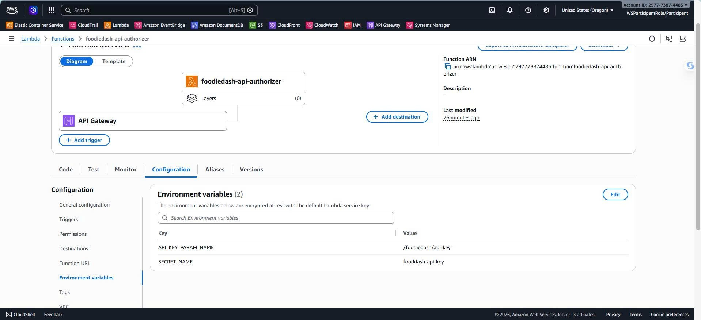
  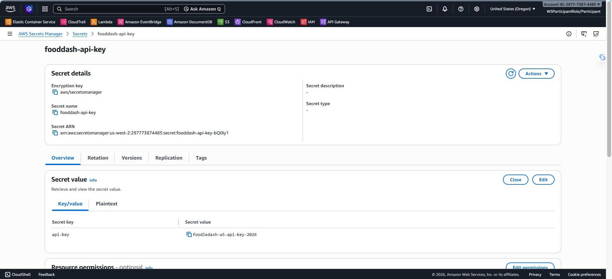
  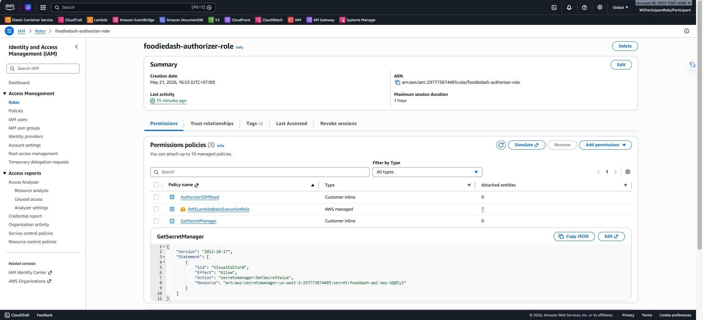
2. ✅ **VPC Flow Logs** retention 7 → 30 days (now applied to ALL foodiedash log groups)
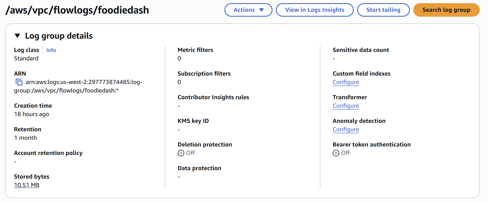
3. ✅ **Danh sách cho phép của Firewall (Firewall allowlist)** được thu hẹp bằng cách thay đổi wildcard `.amazonaws.com` thành các FQDN cụ thể theo vùng (region-specific FQDNs); thêm S3 Gateway Endpoint vào bảng định tuyến `private_app` (route tables) để định tuyến lưu lượng S3 nội bộ.


4. ✅ **AWS Backup** mở rộng phạm vi bảo vệ cho cả S3 FE và KB buckets (bật tính năng lưu trữ nhiều phiên bản - versioning và bổ sung quyền IAM cần thiết cho AWS Backup).

---

## Section 7 — Optional Bonus (Optimization Actions)

### 7.0. Composite CloudWatch Alarm 

**3 alarms tổng cộng:**

| Alarm | Type | Metric | Threshold | State |
|---|---|---|---|---|
| `High-API-Latency-Alarm` | Metric | `FoodieDash/App.ProductsApiLatency` | > 2000ms | OK |
| `High-Lambda-Error-Rate` | Metric | `AWS/Lambda.Errors` (foodiedash-ai-handler) | > 5 errors / 5min | OK |
| **`FoodieDash-Critical-Composite-Alarm`** | **Composite (AND)** | — | `ALARM(latency) AND ALARM(errors)` | **OK** |

**Architectural intent — Defense against alarm fatigue:**

Trong production, single-metric alarms thường gây "noise":
- API latency spike đơn lẻ → có thể chỉ là cold start, network jitter
- Lambda error spike đơn lẻ → có thể chỉ là retry / transient issue
- **Cả 2 đồng thời** → real outage → page on-call ngay

Composite alarm với logic AND chỉ trigger SNS notification khi **cả 2 metric alarms cùng ALARM**, giảm noise đáng kể. Single metric không page on-call lúc 3 giờ sáng.

**Rule expression:**
```
ALARM("High-API-Latency-Alarm") AND ALARM("High-Lambda-Error-Rate")
```

**Verify:**
```bash
$ aws cloudwatch describe-alarms --alarm-names FoodieDash-Critical-Composite-Alarm --alarm-types CompositeAlarm
{
    "CompositeAlarms": [{
        "AlarmName": "FoodieDash-Critical-Composite-Alarm",
        "StateValue": "OK",
        "AlarmRule": "ALARM(\"High-API-Latency-Alarm\") AND ALARM(\"High-Lambda-Error-Rate\")",
        "ActionsEnabled": true,
        "AlarmActions": ["arn:aws:sns:us-west-2:297773874485:Budget-Alert-Topic"]
    }]
}
```

**📍 Navigation:**
1. Click vào `FoodieDash-Critical-Composite-Alarm` trong list
2. Tab **Details**

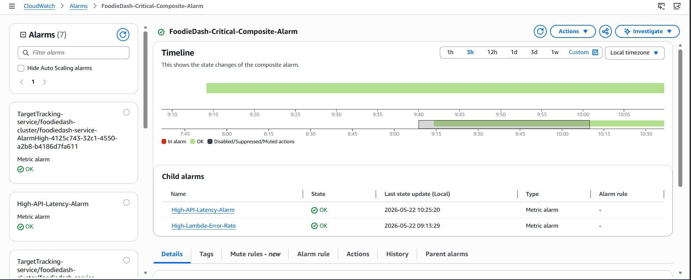

--- 

### 7.1. CloudWatch Agent on Fargate via Sidecar (Innovation)

**Not in spec but elegant solution to a constraint:**

Spec gợi ý "install CloudWatch Agent" — pattern assume EC2. Trên Fargate (no-OS), chúng tôi implement:

- CWAgent dạng sidecar container trong cùng ECS task
- `pidMode: "task"` ở task-level cho phép chung PID namespace
- Plugin `procstat` monitor `exe=node` process từ sidecar
- Push metrics lên `CWAgent` namespace native

**Bonus value:** Demonstrates deep understanding of Fargate vs EC2 observability patterns, and how to retrofit AWS-recommended monitoring on serverless container platforms.

### 7.2. Anti-Infinite-Loop Pattern in Self-Healing Lambda

Security-Healer code check `userIdentity.arn` để skip event do chính Lambda gây ra. Cách thông thường là configure EventBridge rule chỉ catch `Delete*` events, nhưng:
- Catch cả `Put` + `Delete` cho phép detect external misconfigurations (someone manually disable then re-enable wrongly)
- Anti-loop trong code = defense-in-depth

### 7.3. Cost Discipline Story (Wasteful → Changed) — Bonus +0.25

**Reflection (130 words):**

> Trong W5, group 8 deploy không kiểm soát chi phí: DocumentDB chạy 2 instance Multi-AZ (primary + replica db.t3.medium), Lambda ai-handler bật Provisioned Concurrency 1 unit (~$0.015/h), Network Firewall 2-AZ endpoints ($0.79/h), và Bedrock KB ngầm tạo OpenSearch Serverless ($0.46/h). Tổng W5 burn $149.38 trong 3 ngày = ~**$49.8/ngày** — nếu W6 giữ nguyên sẽ vượt $150 cap. **Action lấy ở W6:** (1) xóa DocDB replica (giữ primary đủ cho dev workload), (2) bỏ Provisioned Concurrency (đã prove ở W5 không cần re-prove), (3) viết AutoStop/AutoStart Lambda + EventBridge cron tắt ECS Fargate (UpdateService desiredCount=0) + DocDB (StopDBCluster) từ 22:00–07:30 ICT hằng ngày, (4) ECS desiredCount=1 (single task). **Kết quả đo được:** W6 actual = $27.33 trong 3 ngày = **$9.1/ngày**, giảm **~82%** so với W5 burn rate. 48h workshop forecast $18–20, an toàn dưới cap $150.

**Numbers comparison:**

| Metric | W5 | W6 | Delta |
|---|---|---|---|
| Total cost (3 days) | $149.38 | $27.33 | **−81.7%** |
| Daily burn rate | $49.79/day | $9.11/day | **−81.7%** |
| DocDB instances | 2 (primary + replica) | 1 (primary only) | -50% RDS cost |
| Lambda PC | 1 unit always-on | 0 | save $0.015/h |
| Compute uptime (per day) | 24h | 14.5h (07:30–22:00) | **−40%** |
| Cost discipline mechanism | None | AutoStop + AutoStart | **automated** |

---

## Section 8 — Files Index

| File | Purpose |
|---|---|
| `W6/W6_evidence.md` | This file — Evidence Pack |
| `docs/W6_overnight_run_report.md` | Detailed run log of W6 autonomous setup |
| `W5/W5_evidence.md` | W5 Evidence Pack reference |
| `terraform/` | Infrastructure as Code |
| `XOPS_BE/lambda/cost-control/` | AutoStop + AutoStart Lambda code |
| `XOPS_BE/lambda/security-healer/` | Self-Healing Security Lambda code |
| `XOPS_BE/lambda/api-canary/` | Canary Lambda code |


---

## Section 9 — Quick Commands for Re-verification

```bash
# Set credentials first, then:

# 1. App health
curl -s -o /dev/null -w "%{http_code}\n" https://fy9aqql720.execute-api.us-west-2.amazonaws.com/api/products

# 2. CWAgent metrics
aws cloudwatch list-metrics --namespace CWAgent --query 'length(Metrics[])'

# 3. Alarm state
aws cloudwatch describe-alarms --alarm-names High-API-Latency-Alarm \
  --query 'MetricAlarms[0].StateValue' --output text

# 4. Canary firing
aws cloudwatch get-metric-statistics --namespace AWS/Lambda --metric-name Invocations \
  --dimensions Name=FunctionName,Value=FoodieDash-Api-Canary \
  --start-time $(date -u -d '15 min ago' +%Y-%m-%dT%H:%M:%S) \
  --end-time $(date -u +%Y-%m-%dT%H:%M:%S) \
  --period 60 --statistics Sum

# 5. Repeat Security-Healer demo loop (for fresh screenshots)
aws s3api delete-public-access-block --bucket foodie-knowledgebase
sleep 30
aws s3api get-public-access-block --bucket foodie-knowledgebase   # Should be restored

# 6. Re-trigger Cost Guard (for fresh evidence) — WARNING: stops ECS+DocDB
# aws sns publish --topic-arn arn:aws:sns:us-west-2:297773874485:Budget-Alert-Topic \
#   --message '{"test":"re-trigger for evidence"}' --subject "Re-test"
# Then start back:
# aws docdb start-db-cluster --db-cluster-identifier foodiedash-docdb-cluster
# aws ecs update-service --cluster foodiedash-cluster --service foodiedash-service --desired-count 1
```
