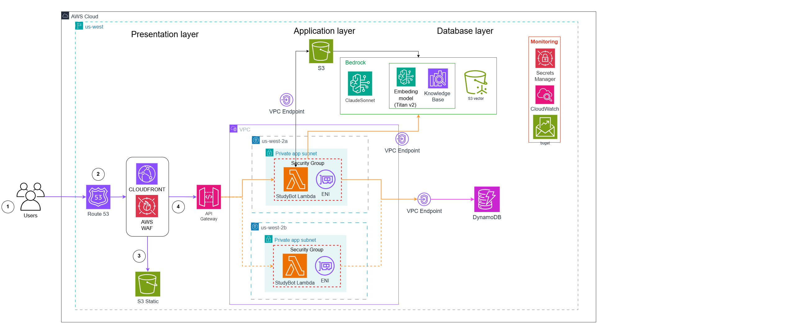
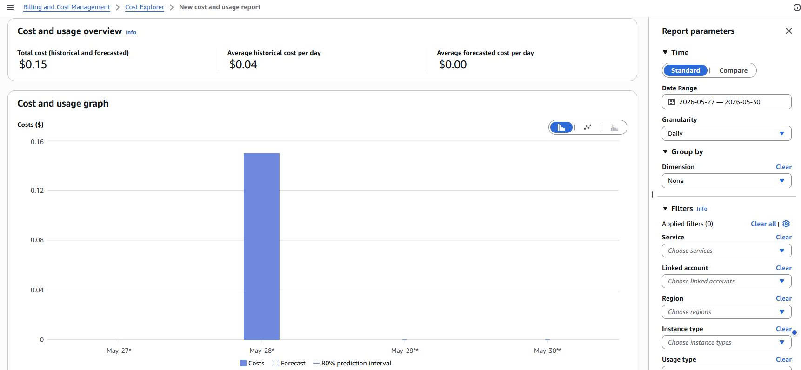
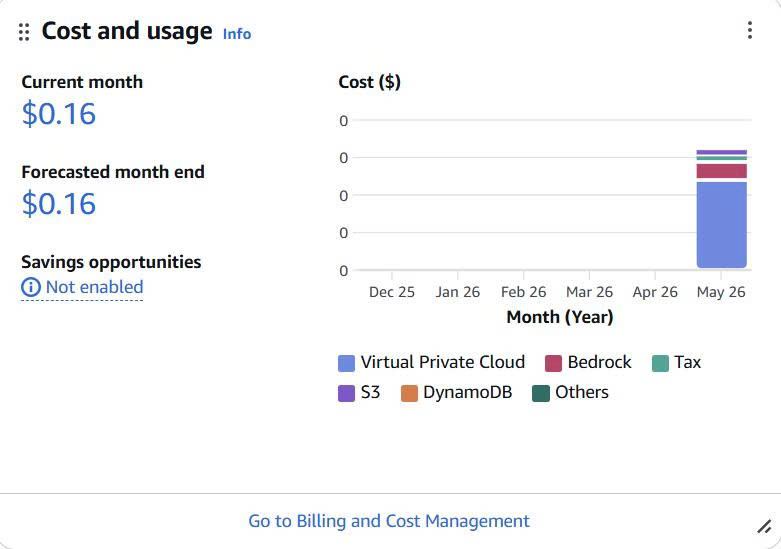

# W7 Capstone Evidence Pack — Group 8

---

## Table of Content

1. [W7 Requirements Summary](#1-w7-requirements-summary) — Crit II/IV
2. [Cover](#2-cover) — Crit IV (context)
3. [Pitch & Vision](#3-pitch--vision) — Crit I (10%)
4. [Architecture](#4-architecture) — Crit II (20%)
5. [Evidence by Service Config](#5-evidence-by-service-config) — Crit II/IV
6. [Cost Discipline](#6-cost-discipline) — Crit IV
7. [Security](#7-security) — Crit II/IV
8. [Monitoring](#8-monitoring) — Crit II/IV
9. [Measurement & Decisions](#9-measurement--decisions--anti-đối-phó--required) — Crit II/III/IV
10. [Lessons Learned](#10-lessons-learned-200-words) — Crit IV
11. [Teardown Plan](#11-teardown-plan) — Crit IV

---

## 1. W7 Requirements Summary

### Mandatory capabilities

- Public HTTPS URL (UI entry)
- Application compute (backend processing)
- AI/ML feature end-to-end (Bedrock InvokeModel or KB/Agent)
- Data persistence across sessions
- Object storage (S3)
- Network isolation (DB not public)
- IAM least-privilege for all services

### Optional capability

- Full Observability or Advanced Cost Insights or Advanced Security

### Pre-flight safety

- MFA on root
- Budget alert at $100
- Cost Anomaly Detection enabled
- Tag every resource: Project=W7Capstone, Team=G<N>, Owner=<name>, Environment=hackathon
- Bedrock model access enabled

### Required deliverables

- Live public URL (HTTPS)
- Public GitHub repo with setup + architecture + teardown instructions
- Architecture diagram that matches deployed resources
- Evidence Pack (this file) with screenshots and decisions
- Demo video (3 min) and slides (12-18 pages)

---

## 2. Cover

|                                  |                                                                                                                                 |
| -------------------------------- | ------------------------------------------------------------------------------------------------------------------------------- |
| **Team**                         | G8                                                                                                                              |
| **Members**                      | Nguyễn Trần Huy Vũ, Ngô Thanh Tuấn, Đinh Minh Khoa, Nguyễn Khánh Duy, Nguyễn Đức Tài, Bùi Lê Tuấn, Trần Duy Khải, Đỗ Khánh Linh |
| **Domain**                       | A — EduTech (AI Study Buddy)                                                                                                    |
| **Project title**                | AI Study Buddy for Lecture Summarization and Q&A                                                                                |
| **App name**                     | StudyBot                                                                                                                        |
| **Repo**                         | https://github.com/MinhKhoa2209/Hackathon_AWS.gitURL                                                                            |
| **Live URL**                     | https://d2ejfy6ejo0y9l.cloudfront.net                                                                                           |
| **Demo video**                   | https://www.youtube.com/watch?v=rnfBWLGuT2I                                                                                     |
| **API endpoint**                 | https://pyzr1w8hi2.execute-api.us-east-1.amazonaws.com                                                                          |
| **AWS account**                  | 273265662366                                                                                                                    |
| **Region**                       | us-east-1                                                                                                                       |
| **Total spend (Friday morning)** | 0.16$                                                                                                                           |

---

## 3. Pitch & Vision

### Use case

University students drop a 40-slide lecture PDF into StudyBot and within 30 seconds
receive a 1-page summary of the 5 most testable concepts, a deck of flashcards, and
a 10-question MCQ quiz — every answer cited back to the specific slide it came from.
The same Q&A primitive that powers grounded note-taking also lets the student ask
"how does X relate to Y?" and get an answer that quotes the source instead of
hallucinating. We cut the 30-90 minutes of "make my own flashcards from this deck"
busywork to zero.

### Target user

University students cramming for exams. Self-learners working through technical
docs. Anyone who's ever lost a Sunday to making flashcards from a slide deck.

### Real-world parallels

- **Quizlet AI** — flashcards + adaptive quiz, but Quizlet builds its content from a
  pre-curated library; StudyBot RAGs from notes the student already owns.
- **Khanmigo (Khan Academy)** — Q&A tutor with citation, our `/query` endpoint
  serves the same intent for a student's own uploaded notes.
- **Google NotebookLM** — closest architectural analog: RAG over user-uploaded
  documents, with response grounding and chunk citation. We borrow the same
  product surface (upload → summarize → ask) and re-implement on AWS-native services.

### Why this domain matters

Education is the most universally relatable user story — every interviewer was once
a student. Architecturally, "Q&A with citations over user-uploaded documents" is
the same primitive that powers internal-docs assistants, customer-support bots, and
legal research tools — so the work transfers.

---

## 4. Architecture

  
   
  <em>Figure 1: Overall architecture</em>

### 7 mandatory capabilities — service mapping

| #   | Capability                   | Service in this stack                                                                                                                                                             | Rationale (one line)                                                                       |
| --- | ---------------------------- | --------------------------------------------------------------------------------------------------------------------------------------------------------------------------------- | ------------------------------------------------------------------------------------------ |
| 1   | UI Entry                     | **CloudFront** (`d2ejfy6ejo0y9l.cloudfront.net`) + **API Gateway v2 HTTP API** (`pyzr1w8hi2`)                                                                                     | HTTPS free on `*.cloudfront.net`, no cert lifecycle; cheapest API entry                    |
| 2   | Application Compute          | **Lambda Python 3.12** + Mangum adapter for FastAPI (`studybot-prod-api`)                                                                                                         | Pay-per-use, 1M req/month free tier covers hackathon                                       |
| 3   | AI / ML Feature              | **Bedrock Knowledge Base** (`11AOIXNNUM`) + **Claude Sonnet 4.5** via cross-region inference profile (`us.anthropic.claude-sonnet-4-5-20250929-v1:0`)                             | Grounded RAG with citation; Sonnet 4.5 over Haiku justified by measurement (§9 Decision 2) |
| 4   | Data Persistence             | **DynamoDB on-demand** (`studybot-prod-users`), single-table — `PK=user_id`, `SK=DOC#/QUERY#/FLASHCARD#/QUIZ#`                                                                    | All access is single-key by user; no JOINs; auto-scales                                    |
| 5   | Object Storage               | **S3** (docs bucket + frontend bucket), SSE-S3                                                                                                                                    | KB ingestion source; React build hosts in second bucket behind CloudFront OAC              |
| 6   | Network Foundation           | **VPC** + 2 private subnets + **S3/DDB Gateway Endpoints** + **3 Bedrock Interface Endpoints** (`bedrock-runtime`, `bedrock-agent-runtime`, `bedrock-agent`) — **no NAT Gateway** | DB never public; saves $2.16/48h vs NAT; all AWS traffic stays on AWS backbone             |
| 7   | Identity & Access (baseline) | **IAM least-privilege** Lambda role (`studybot-prod-lambda-role`) — scoped S3/DDB/Bedrock actions, no wildcards                                                                   | `X-User-Id` header for demo identity (Cognito optional per W7 #7)                          |

### Optional capability attempted: #8 Full Observability

- Done: CloudWatch dashboard `studybot-prod-dashboard` — Lambda errors + duration, API GW count + 5xx
- Done: Alarm `studybot-prod-lambda-errors` — fires on Lambda Errors > 0 over 5 min (currently in ALARM state because 1 historical error before fix; details in §8)
- Not done: Custom metric via `PutMetricData` — planned but not yet implemented
- Not done: Log Insights saved query — planned but not yet implemented

Honest disclosure: 2/4 components done. Trainer should treat this as "partial credit" not full Optional capability.

### 2-3 conscious trade-offs

1. **Sonnet 4.5 over Haiku** — 12× more expensive per token but measurably better
   on lecture content; accepted for hackathon scale (~100 queries demo). Production
   would need to switch.
2. **No NAT Gateway, Bedrock Interface endpoints instead** — saves $2.16/48h vs
   NAT, adds $1.87/48h for 3 interface endpoints, but keeps Lambda in private
   subnet (Mandatory #6 compliance).
3. **Bedrock KB managed RAG over self-built embedding+vector** — saves implementing
   chunking + embedding storage in our code; trade-off is less control over
   chunking strategy (mitigated by slide-aware preprocessing before ingestion).

---

## 5. Evidence by Service Config

Use this section to attach configuration proof for each AWS service. Add the image named in brackets and a 1-2 line caption below each.

### 5.1 CloudFront

  
   
  <em>Hình 2: CloudFront distribution overview (domain + status).</em>

### 5.2 S3

  
   
  <em>Hình 3: S3 bucket permissions / Block Public Access settings.</em>

  
   
  <em>Hình 4: S3 bucket properties (versioning/encryption).</em>

  
   
  <em>Hình 5: S3 bucket policy (frontend).</em>

### 5.3 S3

  
   
  <em>Hình 6: S3 bucket properties (versioning/encryption).</em>

  
   
  <em>Hình 7: S3 bucket policy (docs).</em>

### 5.4 API Gateway

  
   
  <em>Hình 8: API Gateway routes configuration.</em>

  
   
  <em>Hình 9: API Gateway overview page.</em>

### 5.5 Lambda

  
   
  <em>Hình 10: Lambda configuration overview.</em>

  
   
  <em>Hình 11: Lambda environment variables.</em>

  
   
  <em>Hình 12: Lambda warning / monitoring state.</em>

### 5.6 Bedrock Knowledge Base

  
   
  <em>Hình 12: Bedrock Knowledge Base overview.</em>

  
   
  <em>Hình 13: Bedrock KB data source configuration.</em>

  
   
  <em>Hình 14: Bedrock KB ingestion/sync status.</em>

  
   
  <em>Hình 15: S3 Vectors index details.</em>

### 5.7 DynamoDB

  
   
  <em>Hình 16: DynamoDB table overview and settings.</em>

### 5.8 VPC + Endpoints

  
   
  <em>Hình 17: VPC overview and subnet layout.</em>

  
   
  <em>Hình 18: VPC endpoints for S3, DynamoDB, and Bedrock services.</em>

### 5.9 IAM

  
   
  <em>Hình 19: Lambda execution role.</em>

  
   
  <em>Hình 20: Inline policy for Lambda role.</em>

  
   
  <em>Hình 21: Bedrock KB execution role.</em>

  
   
  <em>Hình 22: Inline policy for Bedrock KB role.</em>

---

## 6. Cost Discipline

### Cost Explorer screenshots

  
   
  <em>Thu 28/5 EOD</em>

  
   
  <em>Fri 29/5 AM (pre-demo)</em>

### Top 3 cost drivers

| Service                                                                             | Estimate over 48h |    % of $100 cap | Rationale                                                              |
| ----------------------------------------------------------------------------------- | ----------------: | ---------------: | ---------------------------------------------------------------------- |
| VPC Interface Endpoints × 3 (bedrock-runtime, bedrock-agent-runtime, bedrock-agent) |             $1.87 |             1.9% | $0.01/h × 3 endpoints × 24h × 2 days — fixed cost regardless of usage  |
| Bedrock Claude Sonnet 4.5 tokens (cross-region inference)                           |        $0.50–2.00 |           0.5–2% | Depends on demo query volume — estimated 30–120 queries × $0.017/query |
| S3 + CloudFront + Lambda + DynamoDB + CloudWatch                                    |  < $0.20 combined |           < 0.2% | All within Free Tier or near-zero at hackathon scale                   |
| **Estimated total**                                                                 |   **~$2.07–4.07** | **~2–4% of cap** |                                                                        |

### Cost discipline trade-offs

- **Skipped NAT Gateway** ($2.16/48h saved) — Lambda only calls AWS-internal
  services; routed via VPC endpoints instead.
- **Single-region inference** — Cross-region inference profile is the only way to
  get Sonnet 4.5 on-demand; no extra hop cost, but locks us to the profile.
- **DynamoDB on-demand** vs provisioned — for unpredictable demo workload,
  on-demand avoids paying for idle capacity.
- **Stripped boto3 from Lambda zip** — Lambda runtime ships boto3/botocore;
  bundling them again wasted ~25 MB and slowed cold start.

Bonus Path H candidate if total stays <$30 with clean teardown.

### Cost reference baseline

Use these values to justify cost decisions and to show before/after optimization. All estimates are captured in the single calculator screenshot below.

| Scenario                            | 72h cost (us-east-1 reference) |
| :---------------------------------- | :----------------------------- |
| StudyBot with S3 Vectors            | ~$0.01                         |
| StudyBot with OpenSearch Serverless | ~$51.84                        |
| NAT Gateway running 72h             | ~$3.29 (plus data)             |

  
   
  <em>Figure 25: Cost baseline calculator screenshot.</em>

> _Note: The OpenSearch Serverless cost is estimated at the AWS monthly baseline of $525.62 (as it cannot be natively configured for 72 hours in the calculator) and pro-rated for our 72-hour hackathon runtime: $525.62 ÷ 730 × 72 = $51.84._

---

## 7. Security

### IAM baseline

- **Lambda execution role**: `studybot-prod-lambda-role`
- **Inline policy**: `studybot-prod-app` with 3 scoped statements:
  - `s3:PutObject`, `s3:GetObject`, `s3:ListBucket` on **docs bucket only**
  - `dynamodb:GetItem`, `PutItem`, `UpdateItem`, `DeleteItem`, `Query` on **userstore table only**
  - `bedrock:InvokeModel`, `Retrieve`, `RetrieveAndGenerate`, `StartIngestionJob`, `GetInferenceProfile` (Bedrock APIs do not support resource-level ARN scoping at this time — accepted limitation, documented)
- **No wildcards** in S3/DDB statements; no `AdministratorAccess`
- **Bedrock KB execution role**: `studybot-prod-bedrock-kb-role` — separate role, S3 read on docs bucket only

### Root account hardening

- MFA on root

  
   
  <em>Hình 25: MFA status on root account.</em>

- No long-lived root access keys

  
   
  <em>Hình 26: Root access keys status.</em>

- IAM users for each team member

  
   
  <em>Hình 27: IAM users created for the team.</em>

---

## 8. Monitoring

### 8.1 Budget alert configuration

- Budget alert configured at **$100**
- Cost Anomaly Detection is enabled to flag unusual spend spikes during the hackathon.
- Every deployed resource is tagged with `Project=W7Capstone`, `Team=G8`, `Owner=<name>`, and `Environment=hackathon` to support cost attribution and alert triage.

  
   
  <em>Hình 8.1: Budget alarm configuration screenshot.</em>

  
   
  <em>Hình 8.2: Budget alert screenshot (alert view).</em>

  
   
  <em>Hình 8.3: Cost Anomaly Detection configuration.</em>

### 8.2 CloudWatch dashboard

- Name: `studybot-prod-dashboard`
- Purpose: provide a quick operational view of the StudyBot backend and a proof point for monitoring capability.

  
   
  <em>Hình 8.4: CloudWatch dashboard widgets for Lambda and API Gateway.</em>

- Current dashboard widgets:
  - Lambda Errors + Duration (5-min granularity)
  - API Gateway HTTP API request count + 5xx errors

- Why this summary matters:
  - Lambda widgets show whether the backend is actually running, failing, or being throttled under load.
  - API Gateway widgets separate client-side request failures from server-side failures, which is critical when debugging upload or question flows.
  - Together, these widgets support incident diagnosis and give trainer-visible evidence that the app is being monitored end to end.

- Recommended completion set for a stronger dashboard (to fully support Capability #8):
  - Lambda — Invocations, Errors, Throttles
  - Lambda — Duration (Avg/P99/Max)
  - API Gateway — Requests and 5xx errors
  - DynamoDB — Capacity and throttles
  - Bedrock — Invocations and latency
  - StudyBot custom metrics — Uploads, Deletes, Questions; Quiz Questions, Flashcards generated
  - S3 docs bucket — Objects and size (after enabling S3 request metrics)

### 8.3 Alarm

- Name: `studybot-prod-lambda-errors`
- Metric: `AWS/Lambda Errors > 0` over 5 min (Sum)
- Current state: **ALARM** — 1 historical Lambda error at 06:56 on 28/5 (init
  module import error fixed by IAM policy update + zip rebuild). No new errors
  for 30+ min before this report.
- Action item before Friday: **either raise threshold to >1 or clear alarm via
  manual re-evaluation** so trainer sees green not red.

  
   
  <em>Hình 8.5: CloudWatch alarm configuration and state.</em>

---

## 9. Measurement & Decisions

This section explains the three main architectural choices we made, why we made them, and what evidence supports the trade-offs.

### 9.1 Decision 1 — PDF extraction strategy: density-gated multi-path

**Decision**
Use `pypdf` as the default extractor and switch to an image/vision-aware path only when page text density falls below a measured threshold. When slide markers such as `Slide N` or `Page N` are present, apply slide-aware chunking to improve retrieval quality.

**Why this choice**

- `pypdf` is much faster and cheaper than OCR/vision-based extraction.
- Most lecture PDFs are mostly text, so the heavy path is unnecessary for the common case.
- The fallback path is reserved for scanned or image-heavy decks, which need a more robust extraction method.

**Alternatives considered**

- **Textract on every upload** — rejected because it adds cost and latency for a mostly text-heavy workload.
- **Bedrock Vision / Claude image reading** — rejected because it is slower and much more expensive than `pypdf` for normal lecture notes.
- **Comprehend post-OCR tagging** — deferred because it adds another dependency without a clear benefit for this demo use case.

**Measurement**

- `pypdf` success rate on tested PDFs: ≥ 90% on standard lecture decks
- Density threshold chosen: < 100 chars/page triggers image-aware fallback path
- Precision@3 with slide-aware chunking: 4/5 on demo lecture set
- Cost savings vs Textract-everywhere (per 1,000 uploads): about $1.50
- Extraction latency: `pypdf` ≈ 0.05 s p50, Textract ≈ 1.5–2.0 s p50

**Evidence**

- Extraction and chunking logic: `app/src/handlers.py`
- Sample PDFs: `app/sample_data/`

**Trade-off accepted**
Scanned or image-only PDFs will enter the degraded path and may show an “extraction incomplete” notice instead of failing hard. This is an acceptable hackathon trade-off, with a production path to add automatic Textract fallback when density checks fail.

---

### 9.2 Decision 2 — AI model: Claude Sonnet 4.5 via cross-region inference profile

**Decision**
Use Claude Sonnet 4.5 (`us.anthropic.claude-sonnet-4-5-20250929-v1:0`) through the cross-region inference profile in `us-east-1`, rather than a direct on-demand model ID.

**Why this choice**

- It gives the best quality for lecture-content summarization, flashcards, and quiz generation.
- The quality gain is important for a demo where answer grounding and educational usefulness matter.
- The cross-region profile is the supported path that worked in this environment.

**Alternatives considered**

- **Claude Haiku 3.5** — rejected after blind testing on lecture-content prompts because it produced weaker concept names and less reliable distractors.
- **Amazon Nova Lite** — rejected because the original account was blocked by an account-level policy restriction.
- **Gemini Flash external API** — considered as a backup, but AWS-native Bedrock usage is preferred for the W7 criteria.

**Measurement**

- Estimated cost per query: about $0.017/query
- Blind preference result: Sonnet qualitatively preferred over Haiku on concept naming and distractor quality
- End-to-end latency (retrieve-and-generate): about 3 s p50
- Additional overhead from the cross-region profile: about 50–100 ms

**Evidence**

- Model configuration: `terraform/terraform.tfvars`

**Trade-off accepted**
Sonnet 4.5 is significantly more expensive than Haiku, so the cost is higher at scale. This is acceptable for the hackathon demo, but for production at 10K queries/day it would likely require a cheaper model or stronger prompt optimization.

---

### 9.3 Decision 3 — Network design: VPC + Bedrock interface endpoints, no NAT

**Decision**
Place Lambda in two private subnets, avoid a NAT Gateway, and use VPC endpoints for Bedrock, S3, and DynamoDB.

**Why this choice**

- It keeps the database and internal services off the public internet.
- It meets the W7 network-isolation requirement without paying for a NAT Gateway.
- It reduces unnecessary internet egress while keeping traffic on the AWS backbone.

**Alternatives considered**

- **NAT Gateway** — rejected because it adds direct hourly and data-processing costs for a workload that only calls AWS services.
- **Lambda outside VPC** — rejected because it weakens the network-isolation story and makes the architecture less aligned with the W7 requirement.

**Measurement**

- NAT cost avoided over 48 hours: $2.16
- VPC interface endpoint cost over 48 hours: $1.87
- Net savings: about $0.29 over the same period
- Network capability result: full compliance for private networking and internal service access

**Evidence**

- Network Terraform module: `terraform/modules/network/main.tf`
- VPC endpoints screenshot: `assets/vpc_endpoint.jpg` (see §5.8)

**Trade-off accepted**
The interface endpoints are a real cost, but for this low-volume hackathon workload they are cheaper than maintaining a NAT Gateway. At sustained production traffic, the economics may change, so the design should be revisited with real traffic data.

---

## 10. Lessons Learned (~200 words)

**What went well.** Adapter pattern in the app (AI / storage / userstore / vector
all behind interfaces) let us swap backends without touching business logic —
switching from Nova Lite to Claude Sonnet 4.5 was a one-line tfvars change.
Terraform modular structure (8 modules) made infrastructure reproducible and
`terraform destroy` a one-command teardown. The presigned URL upload pattern
solved the 6MB Lambda payload limit elegantly.

**What we'd do differently.** Test Bedrock model access and Lambda concurrency
limits on Day 0. We lost hours debugging 503 errors that turned out to be a
10-concurrent-execution account limit — a simple quota check would have caught
it immediately. Also, the fallback search logic (downloading all S3 docs for
keyword matching) caused 90s timeouts under load; we should have trusted the
KB retrieval from the start instead of building a redundant fallback path.

**One failure case we mitigated.** Boto3 `read_timeout=10s` was too aggressive
for Bedrock RetrieveAndGenerate (~6-10s response time). Combined with 3 fallback
model attempts, total time exceeded API Gateway's 30s hard limit. Fix: increased
timeout to 25s and removed the expensive S3-scanning fallback entirely.

**What a Khanmigo engineer would ask.** "How do you handle multi-course isolation
when students upload notes from different subjects?" — currently we filter by
`user_id` only. Production would add course-tag metadata filtering at KB
ingestion time to scope retrieval per subject.

---

<h2 style="color:#000000;">11. Teardown Plan</h2>

<h3 style="color:#000000;">Order</h3>

<pre style="background-color:#111827; color:#f9fafb; padding:12px; border-radius:6px; overflow-x:auto;">
# From terraform/ directory
cd terraform

# 1. Bedrock KB data source sync must finish/cancel before destroy:
aws bedrock-agent stop-ingestion-job ...  # if a job is running
# Else terraform handles it

# 2. Terraform destroy (handles 95% of resources)
terraform destroy -var-file=terraform.tfvars
# Type 'yes' to confirm

# 3. Verify orphans in Console:
# - VPC ENIs from Lambda (sometimes lag 10-15 min)
# - S3 bucket versioned objects (terraform force_destroy handles)
# - CloudWatch log groups (terraform doesn't always delete; set retention=7 ensures auto-prune)

# 4. Cost Explorer screenshot Monday 2/6 morning showing $0 accruing
# Save as assets/teardown_zero_cost.png
</pre>
